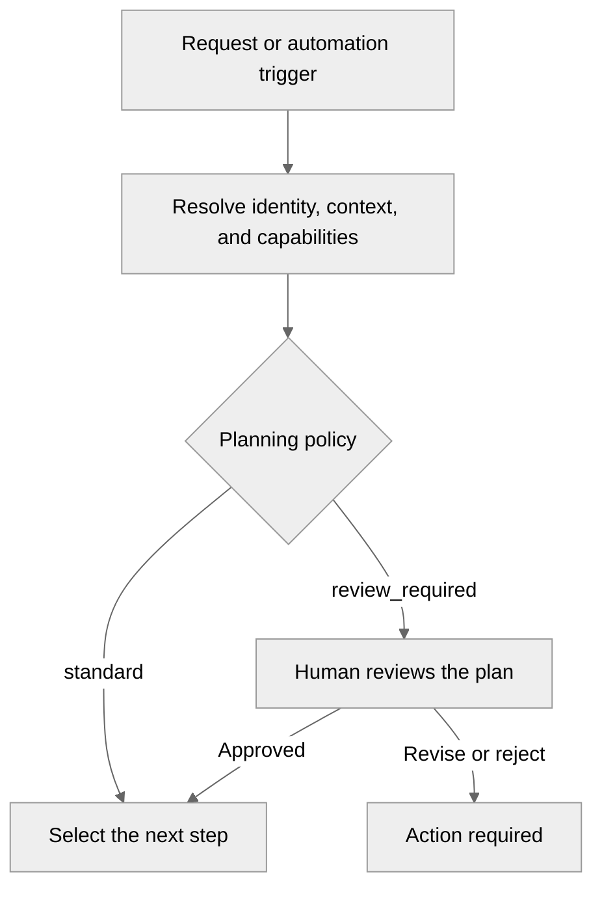
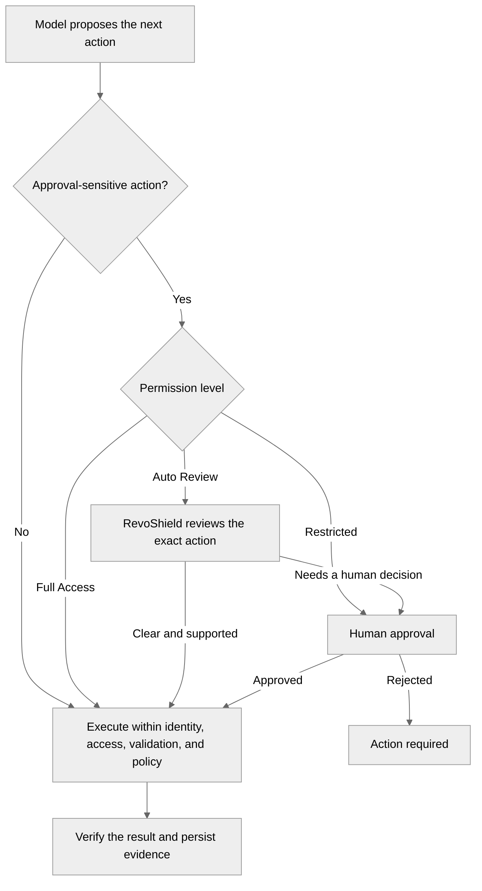

The **RevoEngine Agent Harness** is the product runtime around the selected model. It turns a model response into controlled work against the application platform: it supplies authorized context, exposes governed capabilities, persists progress, pauses for decisions, and verifies outcomes.

The model provides interpretation and reasoning. The Harness owns the execution contract. Plan review and action approval are separate controls: a task can use either, both, or neither.

### Plan review

The planning policy decides whether implementation must wait for a person to review the proposed plan.

### Action approval

The permission level is evaluated only when the proposed action requires approval. Read-only work and actions explicitly permitted by policy do not enter this branch.

One task can pass through the action cycle several times. The Harness reevaluates identity, target, evidence, and policy for each capability call; approval of one action does not authorize the next one automatically. **Full Access** skips the normal action-approval prompt, but never bypasses identity, roles, ACLs, validation, tenant policy, blocked operations, or plugin rules.

## What the Harness adds to a model

| Harness responsibility | Product outcome |
| --- | --- |
| Identity and access | Every read and action executes as the current user or the Agent's service account, with roles and resource ACLs applied at execution time. |
| Context grounding | The model can resolve current Components, Endpoints, data, Storage, automation, Agent runs, versions, dependencies, and operational evidence instead of relying only on pasted text. |
| Capability admission | Only capabilities enabled for the current instance, identity, thread or Agent, and policy are callable. Availability never grants data access by itself. |
| Planning and turn control | Complex work can be represented as a reviewable plan, continued across several capability calls, steered, paused, cancelled, retried, or resumed from durable state. |
| Safety and approvals | Reads, writes, execution, external effects, and destructive actions are treated differently. An eligible action can proceed, enter automatic review, or wait for a person. |
| Memory and workspace | Soft learned context, active task state, and durable files have separate ownership and lifecycle rules. |
| Evidence and recovery | Tool outcomes, plans, actions, run events, artifacts, and terminal states remain inspectable after a browser disconnect or later continuation. |

The Harness does not make a model infallible. It makes the model's work bounded, observable, and recoverable within the product contract.

## Interactive and autonomous execution

RevoEngine uses the same Harness in two operating modes:

| Mode | Current product surface | Best fit |
| --- | --- | --- |
| **Interactive Agent** | Currently shown as **Assistant** and thread-based work in the UI and API | Investigation, design, coding, operations, and supervised changes where a person can steer or approve the work |
| **Autonomous Agent** | Managed **Agents**, runs, Inbox, schedules, events, and handoffs | Durable, queued, recurring, event-driven, or independently operated responsibilities |

The difference is not simply whether a chat window is visible. Autonomous execution adds a stable Agent definition, service-account identity, run/session lifecycle, triggers, workspace, limits, and operator recovery controls.

## Context is selected, not dumped

The Harness does not place every available document, tool, skill, or historical result into every model request. It uses several levels of context:

1. **Stable operating contract** — product behavior, safety rules, and current task instructions.
2. **Authorized references and evidence** — exact resources, versions, logs, files, or execution history required for the current decision.
3. **Capability definitions** — callable operations admitted for the current execution context.
4. **Deferred guidance and integrations** — compact summaries that can be expanded only when relevant.
5. **Soft memory** — bounded learned context that can help but never outranks the current request, configuration, policy, or exact evidence.

This keeps the working context focused and reduces the risk that stale or unrelated material drives a decision.

## Tools, skills, plugins, and packages

These concepts are related but not interchangeable:

| Concept | Role in the Harness | Execution behavior |
| --- | --- | --- |
| Native capability | RevoEngine-owned operation over platform context, validation, Storage, operations, or another supported domain | Executes through the platform's authorization and safety boundary |
| Component tool | A versioned RevoEngine Component exposed as a callable business capability | Runs in the managed component execution contract |
| MCP tool | An admitted operation discovered from a connected MCP server | Runs through the synchronized plugin contract and its Secret-backed authentication |
| Skill | Focused workflow guidance for choosing and combining capabilities | Guides the model; it does not grant access or execute by itself |
| Package | A product-level bundle of skills and capability dependencies | Provides one reviewable installation and lifecycle boundary |

An organization can therefore turn existing business Components into Agent tools, connect an external MCP server, add its own operating playbook as a skill, or publish a package that combines all three.

## Deferred and eager loading

Loading is designed to balance discoverability with context size:

- attached packages and skills can provide a compact summary before their full guidance is needed;
- deferred tools can be discoverable without placing every complete schema in the initial model context;
- full skill content is loaded only for the selected workflow, including required dependencies;
- when **Eager skill loading** is enabled, selected read operations can attach the relevant reviewed skill to their evidence result, avoiding another round trip;
- auto-discovered plugins remain deferred candidates until the task actually selects them;
- a capability that is disabled, inaccessible, or blocked by policy cannot be made executable by loading its description.

Research capabilities follow the same rule. Public web research or RevoEngine Docs search is visible to the model only when the instance and current execution admit it. Enabling research adds a read capability; it does not turn public content into trusted instance state.

See [Tools and skills](/ai/tools-and-skills) and [Plugins](/ai/plugins) for the operator-facing contracts.

## Plans, guards, and RevoShield

A plan describes future work and its acceptance boundary. It can be used as a live execution tracker or as a mandatory review gate before implementation. Plan approval does not silently approve every later side effect.

For an action, the Harness evaluates multiple independent boundaries:

1. Is the capability admitted for this thread or Agent?
2. Can the execution identity access the target?
3. Is the request valid for the current target and version?
4. What effect can the operation produce?
5. Does tenant, Agent, or plugin policy require a review?
6. Is the available evidence sufficient to execute or verify the result?

With **Auto Review**, RevoShield evaluates an eligible proposed action against the explicit request and available authorized evidence. It can let a clearly in-scope action continue, but it falls back to a person when intent, target, effect, evidence, or risk is insufficient. RevoShield is a review layer—not a permission grant, administrator bypass, or replacement for least privilege.

Read [Approvals and plans](/ai/approvals-and-plans) for the complete user-visible behavior.

## Memory, continuity, and compaction

The Harness keeps different continuity problems separate:

- the thread or run retains the active conversation and execution state;
- a plan tracks the current intended work;
- a run checkpoint supports durable autonomous continuation;
- memory provides optional learned context for future work;
- a workspace stores exact files and reviewed artifacts.

When a long conversation must be compacted, the runtime preserves the recent task, decisions, active plan, and reloadable references instead of treating an arbitrary text summary as proof that prior work completed. Exact current state should still be re-read before a consequential action.

## Current execution boundary

Today, RevoEngine is optimized for governed work inside the RevoEngine application and operations model. It supports managed component validation and execution, but it does **not** promise an unrestricted host shell or a general-purpose coding VM to every Agent.

Isolated terminal and workspace execution is an active product direction. Until it becomes an enabled public capability, choose a repository-native coding agent for broad shell, package-manager, build-system, or arbitrary filesystem work, and use RevoEngine for platform-native context, operations, automation, and governed changes.

## What remains private

The public Harness contract explains responsibilities and observable behavior. It intentionally does not publish private prompts, internal routing heuristics, model request bodies, infrastructure topology, hidden diagnostic artifacts, or capability-selection algorithms.

<CardGroup cols={2}>
  <Card title="Compare agent categories" href="/ai/compare-coding-agents" icon="scale-balanced">
    Decide when RevoEngine, a repository coding agent, or both should own the work.
  </Card>
  <Card title="Interactive Agents" href="/ai/assistant" icon="messages">
    Use supervised, thread-based execution.
  </Card>
  <Card title="Autonomous Agents" href="/ai/agents" icon="robot">
    Operate durable responsibilities, triggers, runs, and workspaces.
  </Card>
  <Card title="Memory and workspaces" href="/ai/memory-and-workspaces" icon="folder-tree">
    Place learned context, active state, and files in the correct store.
  </Card>
</CardGroup>
