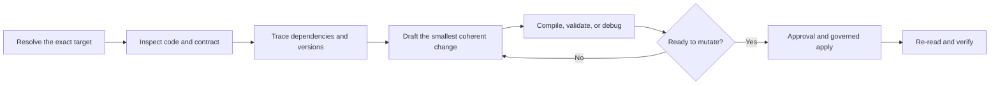

Agentic coding connects conversational intent to the versioned application model already managed by RevoEngine. The Assistant can inspect components and libraries, trace dependencies, work with runtime-aware declarations, validate code, and apply a governed platform change.

This workflow is designed for RevoEngine application code. It does not expose the private implementation of the RevoEngine control plane.

## The evidence-first loop



### 1. Resolve the exact target

Reference the component, endpoint, library, or snapshot version. If the target is not known, the Assistant searches the authorized catalog and asks for clarification only when several candidates would materially change the outcome.

### 2. Inspect the current contract

Before editing, the Assistant can read:

- component metadata, active version, elements, and source;
- endpoint method, path, component binding, input, validation, timeout, and response behavior;
- runtime declarations for `api.*`, `storage.*`, `agent.*`, `util.*`, and active `lib.Category.Name.ElementKey.X` dependencies;
- historical snapshots and differences between versions;
- dependent components, endpoints, libraries, and other affected definitions.

### 3. Draft for the correct runtime

Choose the simplest component type that satisfies the requirement:

| Target | Use it for |
| --- | --- |
| `CODE_JS` | Standard isolated application and integration logic |
| `CODE_TS` | Typed low-code logic when TypeScript is required |
| `CODE_JS_LIB` / `CODE_TS_LIB` | Shared business logic exposed through `lib.Category.Name.ElementKey.X` |
| `JSON_VALIDATOR` | Reusable JSON input validation |
| `CUSTOM_NODEJS` | Trusted multi-file Node.js code or npm dependencies |

New low-code logic normally uses JavaScript unless you explicitly request TypeScript or the target is already TypeScript. Existing conventions and component type take precedence over a global preference.

### 4. Validate before apply

Depending on the target, validation can include a static contract check, compilation, safe code execution, Sandbox debugging, an endpoint call in the intended environment, or a snapshot comparison. Ask for the exact check you consider acceptance evidence.

### 5. Apply through the platform

The Assistant does not edit production definitions by bypassing RevoEngine. It submits an authorized create, update, restore, deploy, or activation operation through the governed platform path. Side effects are classified and may pause for approval.

### 6. Verify the persisted result

After a successful mutation, the Assistant should read the resulting object or version and run the relevant focused validation. The final response should distinguish:

- what changed;
- which version or target was affected;
- what passed;
- what could not be validated;
- any rollout or rollback consideration.

## Strong prompts for coding work

```text
Review the referenced CODE_TS component for incorrect pagination. Preserve its public output shape. Show the evidence, propose the minimal patch, and do not apply it yet.
```

```text
Find every endpoint that depends on this library. Explain the blast radius before changing any code.
```

```text
Add a bounded retry for retryable upstream failures only. Validate the component in Sandbox and require approval before saving a new version.
```

```text
Compare the current component with version 17 and prepare a rollback recommendation. Do not activate anything.
```

## Generated files and code artifacts

Code previews, execution details, diffs, and generated deliverables can be retained as message artifacts. For durable Agent work, requested files belong in the Agent workspace and should be linked from the run output.

An inline answer is valid when the requested outcome is analysis, a code sample, or a small diff. Do not create a filler file unless the request requires a durable file or a downstream Agent needs one as an explicit handoff.

## Production guidance

<Warning>
  Treat activation, deployment, destructive database operations, secret changes, and external writes as production changes. Use review-required planning for broad work, keep approvals enabled, and validate in Sandbox or a non-production environment first.
</Warning>

- Reference exact targets instead of pasting opaque IDs into prose.
- State compatibility constraints and expected response shapes.
- Ask for dependency analysis when changing a shared library.
- Separate source save, deployment readiness, and activation for custom Node.js components.
- Never paste secret values into a prompt or source file.

<CardGroup cols={2}>
  <Card title="Components" href="/build/components" icon="puzzle-piece">
    Review component types, lifecycle, and composition.
  </Card>
  <Card title="Web IDE" href="/build/web-ide" icon="browser">
    Work directly with runtime-aware code and navigation.
  </Card>
  <Card title="Debugging" href="/build/debugging" icon="bug">
    Validate behavior and investigate failures.
  </Card>
  <Card title="Approvals and plans" href="/ai/approvals-and-plans" icon="list-check">
    Put a human review boundary around implementation.
  </Card>
</CardGroup>
