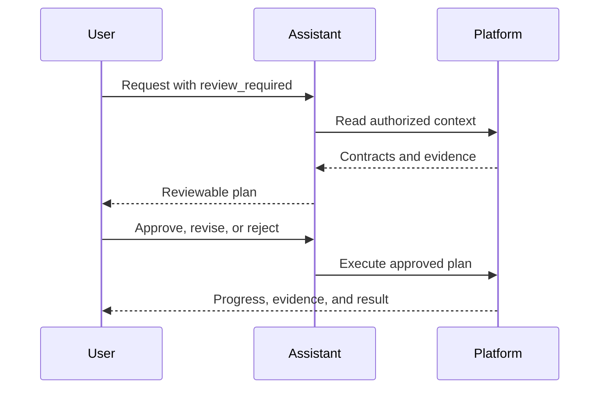

The [Agent Harness](/ai/agent-harness) separates three controls that are easy to confuse: **execution mode**, **planning policy**, and **permission policy**. They work together, but each answers a different question.

| Control | Question it answers | Typical choice |
| --- | --- | --- |
| Execution mode | How interactive or autonomous should this turn be? | `interactive` for supervised work; `background` or `automation` for durable work |
| Planning policy | Must implementation wait for plan review? | `standard` for normal work; `review_required` for a mandatory review gate |
| Permission policy | How should an approval-sensitive action be routed? | **Restricted**, **Auto Review**, or **Full Access**, depending on the required supervision |

## Execution modes

| Mode | Behavior |
| --- | --- |
| `interactive` | Can pause for an approval or clarification and wait for the user |
| `execute` | Proactively pursues the requested outcome in a normal Assistant turn while preserving policy gates |
| `background` | Uses durable background recovery and should avoid unnecessary user-blocking pauses |
| `automation` | Intended for autonomous Agent work triggered by queues, schedules, or events |

Execution mode does not grant access. Identity, roles, admitted tools, per-tool policy, and plugin rules still apply.

## Planning policies

### Standard

`standard` does not require an explicit plan-review gate. The Assistant or Agent can report progress when useful and remains subject to normal action approvals.

Use it for direct questions, small changes, focused investigations, or work whose next step is already clear.

### Review required

`review_required` creates a user-review boundary before implementation. The Assistant may use read-only discovery and investigation tools to ground the proposal, then presents a structured plan and pauses.

The plan contains future work—not a retrospective list of research already completed. A useful plan identifies targets, implementation steps, validation, and rollout or rollback where relevant.

You can:

- **Approve** the proposed plan and begin execution.
- **Submit feedback** to revise it without activating the previous proposal.
- **Reject** it and end that path.

Approval of a plan is not blanket approval for every future side effect. Exact mutations can still require their own action approval.

## Permission levels

| Permission | Intended use | Behavior |
| --- | --- | --- |
| **Restricted** | Maximum supervision and sensitive production work | Read-only work and actions explicitly permitted without approval can proceed. Approval-sensitive changes, side-effecting code, external communication, and other material effects wait for you. |
| **Auto Review** | Well-scoped day-to-day work with fewer interruptions | When an action would otherwise need approval, RevoEngine checks it against your explicit request and the authorized context available for the task. A clearly matching action can continue automatically; uncertain, unsupported, or higher-risk work waits for you. |
| **Full Access** | Trusted, tightly controlled workflows | Normal per-action approval prompts are skipped. Identity, roles, target access, validation, tenant rules, plugin restrictions, and other platform safety boundaries still apply. |

These levels control approval behavior. They do not grant the Assistant or Agent access to data, tools, plugins, or operations that the current identity cannot otherwise use. Capability-specific settings can apply a different level to selected actions.

### How Auto Review works

**RevoShield-1** is RevoEngine's specialized Auto Review layer. It is designed to preserve the user's intent while reducing routine approval prompts. Before an eligible action proceeds, it evaluates the exact proposed effect against the user's request, the authorized context available to the task, and the evidence required for that operation.

RevoShield-1 follows these boundaries:

- Read-only investigation can continue without unnecessary interruption.
- Before an approval-sensitive action, RevoEngine checks the concrete target, requested operation, expected effect, and relevant constraints against what the user asked for.
- Each action in a multi-step task is assessed on its own. A necessary step can continue when it is clearly part of the requested outcome, but approval of one step is not blanket permission for later actions.
- Code capable of changing platform data or producing external effects is treated as an action, not as a harmless read merely because it is executed as code.
- If the intent is unclear, the available context cannot establish the effect, the proposal exceeds the requested scope, or the action is too sensitive for automatic approval, the workflow pauses for the user.

<Info>
  RevoShield-1 does not expand access or replace least-privilege configuration. It adds a review boundary between a clear user request and the action proposed to carry it out. Unsupported, stale, ambiguous, or higher-risk actions remain visible decisions for the user.
</Info>

The public contract is the review behavior and the resulting decision evidence. Internal prompts, routing, and provider-specific review payloads are not part of that contract.

<Warning>
  **Full Access** is not an administrator bypass. It does not defeat authentication, tenant isolation, role checks, blocked operations, validation, or external-provider controls. Use it only when the surrounding workflow already provides an equivalent review boundary.
</Warning>

## Action-required states

A thread or run enters `ACTION_REQUIRED` when it cannot safely continue without a decision. The action can be:

- **Approval** for one or more compatible side effects;
- **Plan review** before implementation;
- **Clarification** when a user-owned decision would materially change the result.

Approval actions can support **Approve**, **Approve all compatible actions for this turn**, **Reject**, or **Submit feedback**, depending on the action. Clarifications accept a submitted answer rather than an approval.

The pending action is durable. Resolving it resumes the work from persisted state, and the decision is retained with the execution history.

## Review source changes and decisions

Supported Assistant edits include a comparison of the current and proposed source and editable properties. Inspect the inline comparison in the conversation, or open fullscreen for a side-by-side review. Completed edits retain their comparison and decision history.

With **Auto Review**, eligible actions explicitly requested by the user can continue after a successful automatic review. The conversation distinguishes automatic approval, manual approval, and a return to manual review, with a short explanation of the outcome. Unclear intent, insufficient context, or a stale proposal does not silently become approval.

The decision applies to the version and effect that were reviewed. If the target changes before application, a fresh proposal is required. The review does not bypass roles, access checks or the configured permission policy. See [1.5.0](/changelog/1.5.0) for the full update.

## Outcomes and reviewed plans

Describe the intended outcome in your request and refine it with follow-up messages. A plan is an ordered, reviewable execution contract. The former thread-goal commands and low-code goal methods are no longer part of the supported public surface.

Feedback can use different wording or request a structural change, such as fewer steps. The revised plan is judged through the review flow rather than word overlap. Plan review remains distinct from a clarification answer or permission to perform a particular side effect.

## Recommended patterns

<AccordionGroup>
  <Accordion title="Small read-only investigation">
    Use `interactive` + `standard` + **Restricted**. Read operations complete without unnecessary approval prompts.
  </Accordion>
  <Accordion title="Broad production change">
    Use `interactive` + `review_required` + **Restricted**. Review the plan, then approve exact actions as they are proposed.
  </Accordion>
  <Accordion title="Durable low-risk background task">
    Configure an Agent with `background` or `automation`, bounded tools, concurrency limits, and an approval-routing policy for exceptional actions.
  </Accordion>
  <Accordion title="External or destructive operation">
    Keep explicit approval enabled even if the surrounding investigation is automated. Verify target, scope, reversibility, and expected effect in the action preview.
  </Accordion>
</AccordionGroup>

<Card title="Configure autonomous Agents" href="/ai/agents" icon="robot">
  Apply the same controls to durable runs, inbox work, schedules, and events.
</Card>
