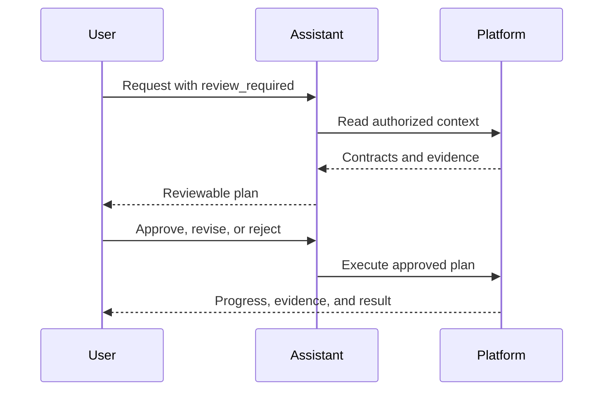

RevoEngine separates three controls that are easy to confuse: **execution mode**, **planning policy**, and **permission policy**. They work together, but each answers a different question.

| Control | Question it answers | Typical choice |
| --- | --- | --- |
| Execution mode | How interactive or autonomous should this turn be? | `interactive` for supervised work; `background` or `automation` for durable work |
| Planning policy | Must implementation wait for plan review? | `standard` for normal work; `review_required` for a mandatory review gate |
| Permission policy | Which side effects require approval? | `default` for production-safe supervision |

## Execution modes

| Mode | Behavior |
| --- | --- |
| `interactive` | Can pause for an approval or clarification and wait for the user |
| `execute` | Proactively pursues the requested outcome in a normal Assistant turn while preserving policy gates |
| `background` | Uses durable background recovery and should avoid unnecessary user-blocking pauses |
| `automation` | Intended for autonomous Agent work triggered by queues, schedules, or events |

Execution mode does not grant access. Identity, roles, admitted tools, per-tool policy, and plugin rules still apply.

## Planning policies

### Standard

`standard` does not require an explicit plan-review gate. The Assistant or Agent can report progress when useful and remains subject to normal action approvals.

Use it for direct questions, small changes, focused investigations, or work whose next step is already clear.

### Review required

`review_required` creates a user-review boundary before implementation. The Assistant may use read-only discovery and investigation tools to ground the proposal, then presents a structured plan and pauses.

The plan contains future work—not a retrospective list of research already completed. A useful plan identifies targets, implementation steps, validation, and rollout or rollback where relevant.

You can:

- **Approve** the proposed plan and begin execution.
- **Submit feedback** to revise it without activating the previous proposal.
- **Reject** it and end that path.

Approval of a plan is not blanket approval for every future side effect. Exact mutations can still require their own action approval.

## Permission policies

| Policy | Intended use | Behavior |
| --- | --- | --- |
| `default` | Production and general use | Side-effecting operations normally pause for review |
| `auto_review` | Bounded, well-understood work | Runtime may auto-review eligible lower-risk actions; higher-risk operations still pause |
| `full` | Tightly controlled expert workflows | Skips normal approval gates where the caller already has authority; other security checks still apply |

Per-tool overrides can narrow or expand the policy for a specific capability. Plugin tools also carry their own mutation and approval metadata.

<Warning>
  `full` is not an administrator bypass. It does not defeat authentication, tenant isolation, role checks, blocked tools, validation, or external-provider controls. Use it only when the surrounding workflow already provides an equivalent review boundary.
</Warning>

## Action-required states

A thread or run enters `ACTION_REQUIRED` when it cannot safely continue without a decision. The action can be:

- **Approval** for one or more compatible side effects;
- **Plan review** before implementation;
- **Clarification** when a user-owned decision would materially change the result.

Approval actions can support **Approve**, **Approve all compatible actions for this turn**, **Reject**, or **Submit feedback**, depending on the action. Clarifications accept a submitted answer rather than an approval.

The pending action is durable. Resolving it resumes the work from persisted state, and the decision is retained with the execution history.

## Durable goals versus plans

A **goal** is a continuing outcome for a thread that can span follow-up turns. A **plan** is an ordered, reviewable execution contract.

Use a goal when you want continuity, for example “finish the migration readiness review.” Use a review-required plan when you need to inspect and approve the implementation path before changes begin.

## Recommended patterns

<AccordionGroup>
  <Accordion title="Small read-only investigation">
    Use `interactive` + `standard` + `default`. Read operations complete without unnecessary approval prompts.
  </Accordion>
  <Accordion title="Broad production change">
    Use `interactive` + `review_required` + `default`. Review the plan, then approve exact mutations as they are proposed.
  </Accordion>
  <Accordion title="Durable low-risk background task">
    Configure an Agent with `background` or `automation`, bounded tools, concurrency limits, and an approval-routing policy for exceptional actions.
  </Accordion>
  <Accordion title="External or destructive operation">
    Keep explicit approval enabled even if the surrounding investigation is automated. Verify target, scope, reversibility, and expected effect in the action preview.
  </Accordion>
</AccordionGroup>

<Card title="Configure autonomous Agents" href="/ai/agents" icon="robot">
  Apply the same controls to durable runs, inbox work, schedules, and events.
</Card>
