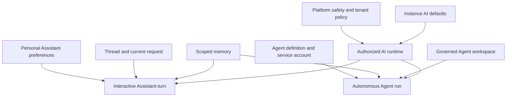

RevoEngine separates AI configuration into layers so administrators can govern the instance without erasing personal working preferences, while autonomous Agents keep their own identity, memory, and file boundary.

<Note>
  Configuration is additive, not a permission shortcut. A global plugin, personal preference, memory entry, or workspace file never grants access that the current user or Agent service account does not already have.
</Note>

## Configuration model

| Layer | Configured by | Applies to | Examples |
| --- | --- | --- | --- |
| Platform safety | RevoEngine and instance policy | Every Assistant and Agent execution | Tenant isolation, authentication, approvals, blocked operations, runtime limits |
| Instance AI settings | Instance Administrator | AI work in the current instance | Global instructions, default plugins, plugin guidance, output ceiling, memory and retention policy, security rules |
| Personal Assistant preferences | Individual user | That user's interactive Assistant experience | Reasoning, planning preference, work mode, persona, and custom instructions |
| Thread or run configuration | User, operator, or automation | One Assistant thread, message, or Agent run | Selected model, explicit plugins, planning mode, current objective and attachments |
| Agent definition and policy | Agent operator | Every run of one autonomous Agent | Identity, mission, service account, Agent instructions, plugins, tool permissions, concurrency |
| Memory and workspace | Runtime and authorized operators | Future work within an exact owner scope | Stable learned knowledge, instruction files, reports, generated code, checkpoints |



The current instruction and verified tool results remain authoritative for the task. Imported preferences and memory provide context; they do not override safety, approval, identity, or exact runtime evidence.

## Administrator: configure AI for the instance

Open **Settings → AI Agents → Configuration** as an Instance Administrator. These settings establish the tenant-wide baseline used by the Assistant and autonomous Agents.

### Global instructions

Global instructions express stable organization-wide expectations, for example:

- use the tenant's approved Components and plugins before ad-hoc alternatives;
- preserve backward compatibility for published Endpoints;
- redact customer identifiers from user-visible reports;
- validate changes in Sandbox before activation;
- return an operation identifier for production mutations.

The editor accepts up to **12,000 characters**. Keep the text concise and policy-oriented. Product safety, authorization, approval rules, the current user's explicit request, and exact execution results still take precedence.

<Warning>
  Do not put credentials, private keys, bearer tokens, or Secret values in global instructions. Store them in [Secrets](/operate/secrets) and expose only the permitted runtime binding.
</Warning>

### Default plugins

Select active registry plugins that should be available by default for AI work in the instance. Instance defaults and explicitly selected plugins remain subject to plugin status, capability policy, operation safety, permissions, and approval requirements. A disabled, deleted, unavailable, or policy-blocked plugin cannot become executable merely because it is configured as a default.

Use **Plugin instructions**—up to **4,000 characters**—for tenant guidance such as which system is authoritative, when a plugin is preferred, or which operations require extra care. Keep capability-specific schemas and authentication in the plugin definition rather than duplicating them in prose.

```text
Use the CRM plugin for customer ownership and contact state.
Use the billing plugin for invoices and settlement status.
Never treat CRM display totals as the financial source of truth.
```

See [Plugins](/ai/plugins) for lifecycle, MCP synchronization, safety metadata, and attachment rules.

### Runtime output limits

The administrator can set the maximum output-token ceiling for AI execution from **10,240** to **128,000**. This is an upper bound, not a target: individual models, tasks, and runtime policies can use less.

Increasing the ceiling can help large code reviews or long structured deliverables, but it also increases latency and cost exposure. Prefer better task scope, references, and artifact workflows before raising it globally.

### Memory policy

The tenant memory policy controls whether memory is enabled, the default recall count, and the retention horizon exposed by the instance configuration.

| Setting | Meaning | Guidance |
| --- | --- | --- |
| Memory enabled | Allows governed memory search and recall | Disable when the tenant must not reuse learned context across sessions |
| Recall limit | Maximum default shortlist, from 0 to 100 | Start small; load only memory relevant to the current objective |
| Retention days | Tenant memory lifecycle, from 1 to 3,650 days where configured | Align with legal, contractual, and operational retention requirements |

Memory is selective. RevoEngine does not convert every answer, tool output, or conversation into durable memory. See [Memory and workspaces](/ai/memory-and-workspaces).

### Storage retention

Instance AI settings also define default retention for private database exports and Agent-created artifacts. Both accept **1–3,650 days**. Expiration archives the file first; permanent removal remains governed by the instance garbage-collection policy.

Use shorter retention for reproducible temporary exports and longer retention only when the artifact is required as durable operational evidence. An Agent can still select a more appropriate explicit lifecycle when policy and the Storage contract allow it.

### AI security rules

Administrators can provide up to **8,000 characters** of security guidance, selection terms, and blocked runtime tool names. Use this layer for tenant-wide restrictions such as credentials, customer data, regulated records, or forbidden external mutations.

Security guidance complements—not replaces—roles, ACLs, service-account permissions, plugin safety metadata, and approval classification. Test both an allowed and a denied example after changing this configuration.

## User: configure personal Assistant defaults

Open **Settings → Assistant**. These preferences belong to the signed-in human account and shape new interactive Assistant messages; they do not redefine an autonomous Agent.

The workspace has **Defaults**, **Instructions** and **Memory** tabs with one **Save** action. Defaults control the response preferences below; Instructions holds personal guidance; Memory lets you inspect, replace or clear your own durable memory text. Memory is context, not an access grant or a replacement for the current request. See [1.5.0](/changelog/1.5.0) for the expanded personal AI workspace.

| Preference | Available behavior |
| --- | --- |
| Hide reasoning | Hides supported reasoning details in the UI; it does not change the selected reasoning effort, validation, or safety policy |
| Reasoning | `None`, `Low`, `Medium`, `High`, or `Extra high` as the default effort for new messages |
| Planner | `Standard` or `Review required`; the latter pauses after planning for an explicit review action |
| Work mode | `Balanced`, `Coding`, `Business`, `Analyst`, `Operator`, or `Creative` |
| Persona | Default, Friendly, Pragmatic, Professional, Concise, Calm, Mentor, or Assertive |
| Custom instructions | Up to 2,000 characters of account-level response guidance |

Personal custom instructions are useful for stable preferences:

```text
Lead with the result. For production changes, include validation and rollback.
Use English code identifiers but explain business impact in Polish.
```

Do not use personal preferences for project facts, passwords, one-off task requirements, or tenant-wide policy. Put the current requirement in the message, stable project context in scoped memory or workspace guidance, and organization-wide rules in instance settings.

### Per-turn overrides

The composer can override model, reasoning, planner behavior, permission level, or plugin selection for the current work. A per-turn choice changes that execution context without rewriting the saved account default. Permission choices are **Restricted**, **Auto Review**, and **Full Access**. Work mode, persona, and custom instructions remain account-level response preferences until changed in **Settings → Assistant**.

For example, keep **Medium + Standard + Auto Review + Balanced** as a daily default, then select **High + Review required + Restricted + Coding** for a risky cross-Component migration.

## Agent: define durable behavior

An autonomous Agent adds another stable layer that personal Assistant preferences do not provide:

- a named identity, mission, responsibilities, operating principles, and success criteria;
- a least-privilege service account used for runtime authorization;
- Agent instructions, model, reasoning, planning, and execution mode;
- Agent-owned and policy-managed plugin attachments;
- default and per-tool permission policy;
- concurrency, child-run, retry, inbox, and trigger behavior;
- scoped Agent memory and a governed workspace root.

The Agent definition is stable configuration. Memory, a workspace file, or a session checkpoint cannot silently rewrite its identity or mission. Update the definition deliberately and preserve the version and activity evidence.

See [Agent configuration](/ai/agent-configuration) for every field and [Autonomous Agents](/ai/agents) for the operational lifecycle.

## Memory: durable knowledge, not conversation history

Use memory only for concise information that should remain useful after the current thread or run:

| Scope | Example |
| --- | --- |
| `USER` | “Prefer concise release summaries with validation first.” |
| `AGENT` | “This Agent validates ledger totals against the settlement View.” |
| `WORKSPACE` | “Reports in this workspace use the approved quarterly template.” |
| `INSTANCE` | “The billing Table is the tenant source of truth for settlement status.” |
| `SHARED` | A deliberately shared convention available to authorized tenant AI work |

Memory use remains bounded by scope, access, and instance policy. Deleted memory is excluded from use and can be restored through its governed lifecycle.

Do not store secrets, full documents, transient progress, raw tool output, or reasoning in memory. Store exact content in Storage and keep only a concise convention or reference in memory.

## Workspace: the Agent's durable filesystem

Every successfully created Agent receives a managed workspace or can be linked to an authorized existing Storage folder. The linked root is an enforced boundary:

- listing, recursive name search, bounded reads, folder creation, upload, and artifact writes stay inside the root;
- the workspace root itself cannot be mutated by the Agent;
- another Agent's managed root cannot be attached as an ordinary shared folder;
- ordinary Explorer writes outside the root retain their normal permission and approval policy;
- downloads and administrative workspace operations still require authenticated Agent access.

Agents can use authorized guidance and files within the workspace root. Keep operator guidance concise, clearly named, and close to the work it governs; keep large reference material in separate files so it can be reviewed and maintained independently.

### Organize concurrent work

Use a predictable structure when an Agent delegates or resumes work:

```text
runs/<agentRunId>/        run-private notes and intermediate artifacts
shared/                   outputs intentionally shared between runs
AGENTS.md                 durable workspace guidance
deliverables/             reviewed final artifacts
```

Run lineage, inbox state, and session checkpoints coordinate execution. Workspace files are for durable content; memory is not a queue or distributed lock.

## Example enterprise setup

<Steps>
  <Step title="Set the tenant baseline">
    Add global engineering and data-handling instructions, attach the approved CRM and billing plugins, configure memory and artifact retention, and block prohibited external tools.
  </Step>
  <Step title="Let users personalize presentation">
    Each engineer selects a work mode, persona, default reasoning level, planner behavior, and concise custom instructions without changing tenant governance.
  </Step>
  <Step title="Create a reconciliation Agent">
    Assign a finance service account, define the reconciliation mission, attach only finance capabilities, and start with review-required mutations.
  </Step>
  <Step title="Use scoped state">
    Keep stable ledger conventions in Agent or Workspace memory, source files and reports in the Agent workspace, and active progress in the durable run checkpoint.
  </Step>
  <Step title="Validate the boundaries">
    Run one allowed read, one approval-gated write, one blocked operation, one memory recall, and one workspace artifact flow. Inspect the same run in Activity and Trace.
  </Step>
</Steps>

## Governance checklist

- Keep global instructions stable, short, and tenant-specific.
- Attach only active, reviewed default plugins.
- Treat plugin defaults as capability availability, not authorization.
- Keep personal preferences out of organization-wide policy.
- Use a dedicated service account for every production Agent responsibility.
- Store knowledge in memory and exact files in the workspace.
- Define retention for memory, exports, and Agent-created artifacts.
- Test allowed, approval-required, and denied operations after policy changes.
- Review Agent workspace ACLs before linking an existing folder.
- Correlate changes and runs through Activity, Trace, and durable execution history.

<CardGroup cols={2}>
  <Card title="Assistant" icon="messages" href="/ai/assistant">
    Work in supervised, persistent threads.
  </Card>
  <Card title="Agent configuration" icon="robot" href="/ai/agent-configuration">
    Configure one autonomous Agent and its policy.
  </Card>
  <Card title="Memory and workspaces" icon="folder-tree" href="/ai/memory-and-workspaces">
    Choose the correct durable state boundary.
  </Card>
  <Card title="Instance settings" icon="sliders" href="/platform/instance-settings">
    Review all instance-wide controls.
  </Card>
</CardGroup>
