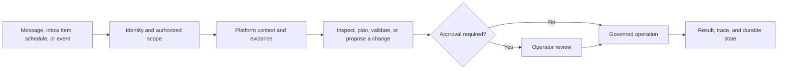

RevoEngine brings AI into the same governed execution and control plane that manages your Components, Endpoints, Jobs, Events, databases, Storage, IAM/ACL, automation, and operational history. The result is more than a chat window: the AI can inspect current platform state, explain it, validate changes, and—when policy allows—carry out work through auditable capabilities.

<CardGroup cols={2}>
  <Card title="Assistant" icon="messages" href="/ai/assistant">
    Work interactively in persistent threads with streaming progress, references, attachments, plans, and approvals.
  </Card>
  <Card title="Agentic coding" icon="code" href="/ai/agentic-coding">
    Investigate implementation, understand dependencies, produce code, validate it, and apply governed changes.
  </Card>
  <Card title="Autonomous Agents" icon="robot" href="/ai/agents">
    Run durable, service-account-backed workers from direct requests, inbox items, schedules, and events.
  </Card>
  <Card title="Plugins" icon="plug" href="/ai/plugins">
    Extend the runtime with component tools, MCP servers, reusable skills, and capability packages.
  </Card>
</CardGroup>

## One runtime, two ways to work

| Surface | Best for | User interaction | Durable state |
| --- | --- | --- | --- |
| **Assistant** | Exploration, design, coding, debugging, and supervised changes | A person drives a thread and can answer questions or approve actions | Threads, messages, plans, actions, visible artifacts, and execution details |
| **Agent** | Recurring, queued, event-driven, or long-running operational work | An operator defines identity, policy, tools, and triggers; the Agent executes independently within those limits | Agent definition, inbox, sessions, runs, run events, workspace outputs, and memory |

Both surfaces use the same platform-aware capability model. Read operations can inspect authorized platform objects and operational evidence. Mutations remain subject to identity, role, capability policy, safety classification, and approval policy.

For a platform-wide view of why this matters to enterprise teams, see [Enterprise execution platform](/platform/enterprise-execution).

## An agentic system for the application lifecycle

A typical coding assistant primarily helps a person understand or produce source code. RevoEngine Agentic System operates within the platform that builds and runs backend applications and services. It can connect engineering intent to governed platform objects, execution evidence, and authorized operations across the backend lifecycle.

| Capability | RevoEngine Agentic System |
| --- | --- |
| Application context | Works with versioned Components, Endpoints, data definitions, Jobs, Events, Storage, and their dependencies |
| Execution boundary | Uses the same governed execution and control plane as the rest of the Platform |
| Authorization | Applies tenant identity, service accounts, roles, permission groups, ACLs, and current resource access |
| Change control | Supports plans, approvals, validation, and policy-bound mutations instead of treating generated code as the final result |
| Operations | Connects changes to execution history, traces, failures, retries, and durable workflow state |
| Continuity | Uses persistent threads, Agent runs, scoped memory, and governed workspaces for work that spans sessions |
| Integrations | Uses approved platform capabilities and plugins with explicit scopes, Secrets bindings, and review policy |

This does not make the AI an unrestricted administrator. The system operates only within the identity, capabilities, policies, and targets admitted for the current task.

## Governed work lifecycle

The execution timeline shown in the UI distinguishes progress, capability activity, approval requests, plan steps, and final messages. Large details and generated files can be retained as governed artifacts.

## Grounded by platform state

The runtime works with stable references to the objects you can access—for example a component, endpoint, database, Agent, job, or stored file. It can inspect current details, read historical snapshots, compare versions, and analyze dependencies before proposing or applying a change.

This grounding is especially important for development work. The Assistant should resolve the intended target, inspect its current contract, and validate the outcome instead of generating code against an assumed schema.

## Governance by default

RevoEngine applies several independent controls:

- **Identity and roles** determine which tenant data and operations are available.
- **Capability policy** limits what a thread or Agent may use.
- **Approval policy** decides whether a side effect can run immediately or must pause for review.
- **Planning policy** can require a reviewable plan before implementation begins.
- **Plugin policy** governs each installed capability, including external MCP tools.
- **Audit evidence** preserves relevant operations and outcomes without exposing Secrets or private platform implementation.

<Warning>
  AI output can be incomplete or incorrect. Keep approval gates enabled for production mutations, review generated code, and validate behavior in Sandbox or a non-production environment before release.
</Warning>

## Choose your next guide

<CardGroup cols={2}>
  <Card title="Configure AI behavior" href="/ai/assistant-configuration" icon="sliders">
    Separate tenant-wide policy, personal Assistant defaults, Agent configuration, memory, and workspaces.
  </Card>
  <Card title="Use the Assistant" href="/ai/assistant" icon="message-bot">
    Learn the thread, reference, attachment, sharing, and execution-detail workflow.
  </Card>
  <Card title="Review plans and actions" href="/ai/approvals-and-plans" icon="list-check">
    Separate execution mode, planning policy, and approval policy.
  </Card>
  <Card title="Configure an Agent" href="/ai/agents" icon="robot">
    Define durable responsibilities, triggers, limits, and operational ownership.
  </Card>
  <Card title="Understand memory and workspaces" href="/ai/memory-and-workspaces" icon="folder-tree">
    Decide where conversation context, learned knowledge, and generated files belong.
  </Card>
</CardGroup>
