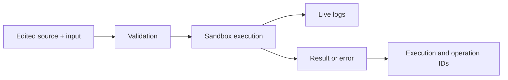

The Sandbox can execute transient edited code or a saved component without exposing it through an Endpoint. Use it to verify inputs, platform calls, logs, result shape, timeout behavior, and library resolution.

Debugging is a development execution, not a deployment state. A successful Sandbox
run does not activate a Component, change an Endpoint, or prove that the production
service account has the same access as the current editor user.

## Debug flow



## Inputs and logs

Inputs are JSON objects. Read the complete input with `api.input()` or a named property with `api.input(name)`. Use `api.log()` for structured runtime diagnostics and never log secrets.

```js
const customerId = api.input('customerId');
if (!customerId) {
  api.throw(400, { message: 'customerId is required' });
}

api.log({ message: 'Loading customer', args: { customerId } });
return lib.CRM.Customers.Queries.load(customerId);
```

Configure the debugger with a JSON input, an explicit timeout and memory budget,
streaming when live logs are useful, and production-mode behavior only for a
deliberate test. Unsaved library overrides can change a result; record whether the
run used editor changes or only active server versions.

## Streaming behavior

Streaming debug and execute operations emit log frames, then exactly one terminal result or error, followed by completion. The stream is request-scoped and is not a durable log tail. Use execution history and trace views for later investigation.

Disconnect normally requests cancellation. Cancellation is cooperative: an external system may have accepted a mutation before the request ended, so verify consequential writes before retrying.

## Debug safety

Some side-effect methods are suppressed in debug mode and produce a warning. Do not assume every integration is simulated; review the runtime declaration and the result before using production data or credentials in a debug run.

## Test the boundary, not only the happy path

| Case | What to prove |
| --- | --- |
| Valid input | Result shape, Logs, timing, Execution ID, and operation ID are usable. |
| Invalid or missing input | The Component returns the intended status and safe error body. |
| Permission denial | The runtime principal cannot read or mutate a protected resource. |
| Dependency unavailable | The error is bounded, redacted, and does not trigger an unsafe retry. |
| Duplicate request | The idempotency rule prevents a repeated external or business mutation. |
| Deadline or cancellation | The execution terminates and consequential side effects are verified before retry. |
| Active-library comparison | The same logic works without dirty editor overrides. |

## Investigate a failed run

1. Capture the Execution ID, operation ID, UTC timestamp, component version, and debugger settings.
2. Find the first failing structured log or platform call; do not diagnose from the final message alone.
3. Confirm the effective principal, role, resource ACL, Secret access, and instance limit.
4. Compare the active library and Component versions with the editor state used in the run.
5. Check the downstream Database, Storage object, Event, Job, or provider before repeating a mutation.

Move an accepted change through [Web IDE](/build/web-ide), activate the intended
version, and repeat a smoke test on the real Endpoint or Job surface.

See [Sandbox API](/developers/sandbox-api) for HTTP entry points and [CLI projects](/developers/cli-projects) for local debug commands.
