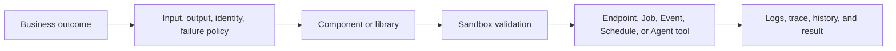

RevoEngine lets teams build application behavior once and use it through HTTP, automation, data workflows, and Agents. The central building block is a **Component**: versioned business logic that can be validated, composed, executed, and connected to a production surface.

Low-code is one authoring option. Teams can also use custom Node.js, shared libraries, the Platform API, SDK, CLI, VS Code, and Agent-assisted workflows.

## Start from the capability

| You want to build | Primary RevoEngine capability | Typical execution boundary |
| --- | --- | --- |
| A synchronous business API | Component + Endpoint | Bounded request/response |
| Durable background work | Component + Job template | Stored Job with terminal state, retry, and history |
| Recurring automation | Component or Agent + Schedule | Time-driven durable dispatch |
| Event-driven processing | Component or Agent + Event | Filtered event delivery with occurrence history |
| Reusable business logic | Library Component | Versioned in-process dependency through `lib.*` |
| Input validation | JSON Validator Component | Reusable validation before business execution |
| A business capability for AI | Component tool plugin | Governed Agent capability with input, output, and safety policy |
| A package-based service | Custom Node.js Component | Managed deployment revision with npm dependencies |
| A data or file workflow | Component + Database/Storage | Authorized reads, writes, exports, and durable artifacts |

## Why Components matter

A Component is more than a code snippet. It gives business behavior:

- a stable platform identity and version history;
- an explicit type and ordered implementation elements;
- current runtime declarations and approved libraries;
- Sandbox validation and execution evidence;
- dependency relationships to Endpoints, Jobs, plugins, and other Components;
- a governed change path instead of an out-of-band script.

The same validated Component can support an Endpoint, background Job, Schedule, Event, another Component, or an Agent plugin. This reduces duplicated business logic and keeps human and AI callers on the same contract.

## Choose an authoring path

| Path | Use it when |
| --- | --- |
| Platform UI and Web IDE | You want visual navigation, runtime-aware types, integrated validation, and direct platform context |
| Low-code JavaScript or TypeScript | The workload fits the managed runtime and should use platform APIs directly |
| Shared libraries | Several Components need the same business rule or integration helper |
| Custom Node.js | The workload needs npm dependencies, multiple source files, or Node.js APIs outside the low-code runtime |
| CLI and VS Code | You want local editing, drift review, generated types, and controlled synchronization |
| SDK and Platform API | An external service or delivery pipeline manages RevoEngine programmatically |
| Interactive Agent | You want the Agent Harness to inspect, plan, validate, and apply a governed platform change |

## Build a capability for Agents

When a business operation already exists as a Component, it can become a **component tool plugin** instead of being reimplemented inside a prompt or remote service.

1. Keep the Component contract narrow and deterministic.
2. Define an explicit input and output schema.
3. Classify whether it reads, writes, executes, affects an external system, or can be destructive.
4. Attach the plugin only to the Interactive or Autonomous Agents that need it.
5. Validate the read path first, then test writes with the intended approval policy.

The plugin does not bypass the Component runtime, service-account permissions, Secrets, timeout, or operational evidence. It gives the Agent a governed entry point to the same application behavior used elsewhere.

## Delivery workflow

The selected surface determines completion semantics. An Endpoint response, accepted Job, dispatched Event, and finalized Storage artifact are different durable facts; design the caller around the one that proves its business outcome.

<CardGroup cols={2}>
  <Card title="Components" href="/build/components" icon="puzzle-piece">
    Choose a Component type and lifecycle.
  </Card>
  <Card title="Low-code runtime" href="/low-code/overview" icon="code">
    Use managed runtime APIs and libraries.
  </Card>
  <Card title="Custom Node.js" href="/build/custom-nodejs" icon="node-js">
    Build trusted package-based workloads.
  </Card>
  <Card title="Agent plugins" href="/ai/plugins" icon="plug">
    Expose business capabilities to Agents.
  </Card>
</CardGroup>
