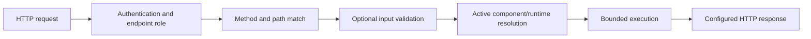

The Endpoint runtime is the execution front door for HTTP routes configured in RevoEngine.

## Control plane versus runtime

- Create, update, inspect, activate, and disable definitions through `/api/v1/endpoints` on the [Platform API](/developers/platform-api).
- Invoke the configured method and path on the instance's Endpoint runtime origin.
- Retrieve a generated OpenAPI document with `GET /api/v1/endpoints/openapi`, or one endpoint with `GET /api/v1/endpoints/{endpointId}/openapi`.

Read the Endpoint runtime origin from your instance configuration. Do not derive it from the Platform API hostname.

## Invoke an endpoint

Given an active `POST /orders/:orderId/confirm` definition:

```bash
curl "$REVO_ENDPOINT_URL/orders/order-123/confirm?notify=true" \
  --request POST \
  --header "Authorization: Bearer $REVO_API_KEY" \
  --header "Content-Type: application/json" \
  --data '{ "channel": "email" }'
```

The runtime matches the HTTP method and path, preferring the most specific active definition. Static and named dynamic path segments are supported. A missing active match returns `404`.

## Request processing



Component code can read request body, query, path values, sanitized headers, and endpoint template inputs through its execution input/context. Authorization and platform-internal headers are not exposed to customer code.

## Validation

An Endpoint can validate its input with an inline guard or a JSON-validator component. Configure the failure status/body independently from the successful response. Validate both accepted and rejected payloads before activation.

## Response modes

An Endpoint may return:

- its component result map when clients explicitly need multiple visible results;
- preferably, one exact visible result selected by `popResult` for a new endpoint with a body;
- an empty body with `noResult`;
- a configured static response when no component is attached;
- an explicit status and body produced by runtime `api.throw(...)`;
- a legacy envelope only when an existing integration still requires `legacyResults`.

Configured normal response codes are successful `2xx` values. A component can deliberately return another code through `api.throw(status, body)`.

<Warning>
  Endpoint invocations are not retried automatically. After a timeout or upstream failure, a mutation may already have reached a database or external provider. Verify state before retrying a non-idempotent call.
</Warning>

## Version and readiness

Low-code endpoints omit `componentVersion` to follow the latest active version, or pin an exact component version for a controlled rollout. Choose that behavior explicitly for a new Endpoint. Custom Node.js endpoints execute the component's selected ready runtime revision; they do not run newly saved source until its deployment is ready and active. If no usable runtime revision exists, invocation fails explicitly.

When a Component is repaired, inspect dependent Endpoints, Job Templates, and Agent Tools. Latest-bound dependents follow the repaired version and require contract validation; pinned dependents remain unchanged. Do not migrate existing dependents to a different version without an explicit compatibility decision.

## Observability

Every invocation receives an Execution ID and a separate distributed operation identifier. Capture response status, timestamp, endpoint ID/version, and the `x-revo-oid` response header when requesting support. Never capture the bearer credential.
