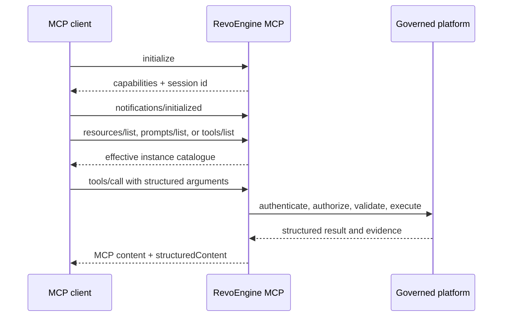

RevoEngine supports Model Context Protocol (MCP) in two complementary directions. External AI clients can use RevoEngine as an authenticated MCP server, while RevoEngine can connect to approved remote MCP servers through governed plugins.

<CardGroup cols={2}>
  <Card title="Use RevoEngine from an MCP client" icon="arrow-right-to-bracket" href="/developers/mcp-connect">
    Discover platform context, resources, prompts, and instance-scoped tools through one Streamable HTTP endpoint.
  </Card>
  <Card title="Connect an MCP server to RevoEngine" icon="plug-circle-plus" href="/developers/mcp-plugins">
    Synchronize remote tools, bind credentials through Secrets, and apply per-tool safety and approval policy.
  </Card>
</CardGroup>

## RevoEngine as an MCP server

The public MCP endpoint gives a compatible client a governed view of the RevoEngine instance associated with its credential. It is useful when an IDE, automation client, or AI application needs to:

- understand RevoEngine platform and low-code semantics before generating a change;
- discover the tools currently available to its authenticated identity;
- search and inspect instance resources without building a dedicated Platform API client;
- perform validated platform actions with structured inputs and outputs;
- load RevoEngine skills, runtime declarations, and change-safety prompts as standard MCP resources.

The production endpoint is:

```text
https://mcp.revoengine.com/mcp
```

<Note>
  MCP is a JSON-RPC protocol surface, separate from the REST-style `/api/v1` Platform API. Its methods are documented in this section and discovered through MCP capabilities rather than generated as individual OpenAPI operations.
</Note>

Authentication, IAM/ACL, instance isolation, schema validation, rate limits, and audit still apply. MCP does not bypass the Platform API's authority model.

## RevoEngine as an MCP client

An MCP server plugin makes approved third-party or private MCP tools available to the RevoEngine Assistant and autonomous Agents. RevoEngine synchronizes the remote manifest, keeps credentials in Secrets, and lets an administrator govern each discovered operation separately.

This direction is appropriate when a team wants RevoEngine AI to work with an existing system without copying its API contract into component code.

## Keep the two directions separate

| Question | Public RevoEngine MCP server | MCP server plugin |
| --- | --- | --- |
| Who initiates the connection? | An external MCP client | RevoEngine Assistant or Agent runtime |
| Which identity is used? | The caller's RevoEngine credential | The plugin's governed Secret bindings and runtime identity |
| Which tools are exposed? | Current RevoEngine catalogue allowed for the caller | Synchronized and enabled tools from the remote server |
| Where is policy enforced? | RevoEngine authentication, permissions, validation, and MCP safety metadata | Plugin availability, attachment, per-tool policy, approvals, and normal runtime authorization |
| Where do I configure it? | In the external MCP client | In the RevoEngine Agent Plugins workspace |

## Request lifecycle



<Warning>
  A direct MCP tool call does not enter the RevoEngine Assistant approval conversation. The MCP client is responsible for its own confirmation experience before a sensitive call. RevoEngine still enforces caller permissions, validation, blocked operations, rate limits, and audit.
</Warning>

## Supported server capabilities

The current public server supports:

- tool discovery and calls;
- resources and resource templates;
- reusable prompts;
- JSON-RPC requests, notifications, and batches;
- session-aware Streamable HTTP;
- an optional authenticated SSE listening connection for session continuity.

Tool availability is dynamic. Always use `tools/list` instead of hard-coding a catalogue from this documentation.

<CardGroup cols={3}>
  <Card title="Connect a client" href="/developers/mcp-connect" icon="link" />
  <Card title="Understand tools" href="/developers/mcp-tools" icon="screwdriver-wrench" />
  <Card title="Troubleshoot" href="/developers/mcp-troubleshooting" icon="stethoscope" />
</CardGroup>
