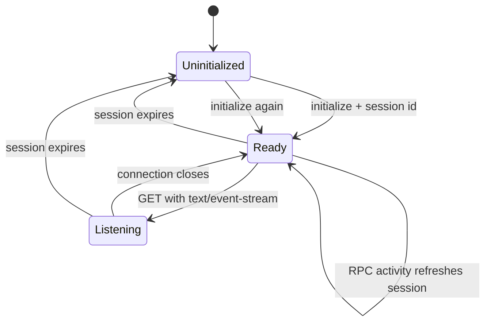

RevoEngine MCP uses JSON-RPC 2.0 over Streamable HTTP. Initialization establishes a session bound to the authenticated instance and credential; later requests may be handled by any healthy service replica without changing that authority boundary.

## HTTP surface

| Method | Path | Authentication | Purpose |
| --- | --- | --- | --- |
| `GET` | `/` | No | Discover the canonical MCP endpoint and advertised transport capabilities |
| `GET` | `/healthz` | No | Check service process health |
| `OPTIONS` | `/mcp` | No | Browser CORS preflight |
| `HEAD` | `/mcp` | Yes | Verify authentication, origin policy, and endpoint reachability without an RPC body |
| `POST` | `/mcp` | Yes | Initialize and exchange JSON-RPC requests, notifications, or batches |
| `GET` | `/mcp` | Yes | Open the optional session listening stream with `Accept: text/event-stream` |

The root discovery document is useful for diagnostics, but clients should configure the canonical `/mcp` URL directly.

## Session lifecycle

<Steps>
  <Step title="Initialize">
    Send `initialize` without a session id. RevoEngine negotiates its current protocol contract and returns `Mcp-Session-Id` in the HTTP response headers.
  </Step>
  <Step title="Acknowledge">
    Send `notifications/initialized` with the returned session id. As a JSON-RPC notification, it has no response body.
  </Step>
  <Step title="Use the catalogue">
    Send the same `Mcp-Session-Id` on `tools/*`, `resources/*`, `prompts/*`, and `ping` calls. Valid activity refreshes the session while policy permits it.
  </Step>
  <Step title="Reconnect when necessary">
    If a long-lived listening connection closes, reconnect with the same session id. If the session has expired, run `initialize` again and replace the stored id.
  </Step>
</Steps>

<Note>
  A session id is scoped to the credential and instance that created it. Reusing it with another key does not transfer access and is rejected without disclosing the original principal.
</Note>

## Supported JSON-RPC methods

| Method | Result |
| --- | --- |
| `initialize` | Negotiated protocol, capabilities, server identity, and operating guidance |
| `ping` | A successful empty result used for liveness |
| `notifications/initialized` | Notification acknowledgment; no JSON-RPC response |
| `tools/list` | Tools currently visible to the caller, including schemas and safety metadata |
| `tools/call` | Validated execution result for one visible tool |
| `resources/list` | Fixed and skill-backed resources |
| `resources/templates/list` | Parameterized resource URI templates |
| `resources/read` | Text or JSON content for one supported resource URI |
| `prompts/list` | Reusable RevoEngine workflow prompts |
| `prompts/get` | Messages for one prompt |

## Notifications and HTTP status

A JSON-RPC request contains an `id` and receives a JSON-RPC result or error. A notification omits `id`; RevoEngine returns HTTP `202` and no JSON body.

Do not treat `202` as an execution receipt for a tool. `tools/call` is a request and returns a normal JSON-RPC response. Use the execution or resource identifiers inside its structured result for later operational tracking.

## Batch requests

RevoEngine accepts a non-empty JSON-RPC array and returns responses only for entries that contain an `id`.

```json
[
  { "jsonrpc": "2.0", "id": "resources", "method": "resources/list", "params": {} },
  { "jsonrpc": "2.0", "id": "prompts", "method": "prompts/list", "params": {} },
  { "jsonrpc": "2.0", "method": "notifications/initialized", "params": {} }
]
```

`initialize` must be sent alone or in a batch containing only initialization calls. RevoEngine rejects a batch that mixes initialization with session-dependent work, preventing a client from using tools before the session boundary is established.

## SSE listening connection

An authenticated `GET /mcp` request with `Accept: text/event-stream` opens a listening connection for the initialized session. The server sends:

- a reconnect recommendation;
- a `connected` event;
- periodic heartbeat comments that maintain session continuity.

The listening stream does not carry tool results, resource updates, or durable notification replay. JSON-RPC results continue to return through `POST /mcp`. If the connection closes, reconnect is client behavior; do not assume that `Last-Event-ID` can replay missed data.

## Session and capacity policy

Session lifetime, request rates, mutation rates, and simultaneous listening connections are managed service policy and can vary by environment or instance plan. On `429`, respect `Retry-After` rather than retrying every failed call immediately.

## Client state machine



<CardGroup cols={2}>
  <Card title="Tool execution" href="/developers/mcp-tools" icon="screwdriver-wrench" />
  <Card title="Errors and recovery" href="/developers/mcp-troubleshooting" icon="triangle-exclamation" />
</CardGroup>
