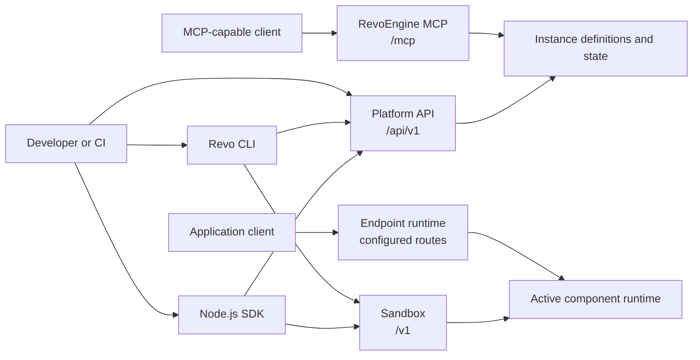

RevoEngine exposes several developer surfaces because managing an enterprise application estate, invoking a public endpoint, executing code, and promoting a release are different operations. All surfaces converge on the same instance-scoped BaaS control plane: versioned definitions, IAM/ACL, operational evidence, and lifecycle actions—not a collection of unrelated APIs.

## Choose an interface

| Surface | Use it for | Primary client |
| --- | --- | --- |
| [Platform API](/developers/platform-api) | Components, endpoints, databases, Storage, automation, identity, Assistant threads, Agents, and operational state | HTTPS or generated OpenAPI client |
| [Endpoint runtime](/developers/endpoint-runtime) | Calling active HTTP endpoints created in RevoEngine | Any HTTP client |
| [Sandbox API](/developers/sandbox-api) | Transient debug, saved-component execution, validation, editor types, and SDK runtime dispatch | RevoEngine UI, CLI, or approved integration |
| [MCP server](/developers/mcp-overview) | Giving MCP-capable IDEs and AI clients governed access to RevoEngine context, skills, tools, and structured operations | Streamable HTTP MCP client |
| [Node.js SDK](/developers/sdk-overview) | Using `api`, `storage`, `agents`, utilities, and active low-code libraries from Node.js | `@revoengine/sdk` |
| [CLI](/developers/cli) | Local editor setup, component sync, debug, drift review, and environment promotion | `@revoengine/cli` |
| [VS Code extension](/developers/vscode-extension) | Component navigation, local review, Git-aware sync plans, debugger runs, and generated runtime types | `revoengine.revoengine` + CLI |



## Base URLs

The public Platform API uses an environment-specific API origin. Production examples use:

```text
https://api.revoengine.com
```

Endpoint runtime and Sandbox origins belong to the authenticated instance. Read them from the instance profile or the platform UI instead of constructing hostnames. The standalone SDK performs this discovery from `GET /api/v1/me` automatically.

## A typical delivery flow

<Steps>
  <Step title="Build">
    Create a low-code, library, or Custom Node.js component. Use generated editor types so local code matches the active platform contract.
  </Step>
  <Step title="Validate">
    Debug transient source in Sandbox, inspect structured logs, and verify success and failure inputs.
  </Step>
  <Step title="Expose or automate">
    Attach the component to an Endpoint, schedule, event, or another supported trigger. Keep definitions inactive until validation is complete when the workflow requires controlled rollout.
  </Step>
  <Step title="Operate">
    Activate a verified version, observe execution identifiers and history, and promote changes between environments with an explicit plan.
  </Step>
</Steps>

## Contract sources

- The [API reference](/api-reference/introduction) is generated from the current Platform API OpenAPI document.
- Sandbox request DTOs and the published SDK contract define executable payloads.
- CLI-generated types describe the effective low-code and library surface for the authenticated instance.
- MCP resources, prompts, tool schemas, and safety metadata describe the effective Agentic client surface for the authenticated session.

<Warning>
  Never place API keys, secret values, signed upload URLs, or raw authorization headers in source control, browser code, logs, screenshots, or Assistant prompts.
</Warning>
