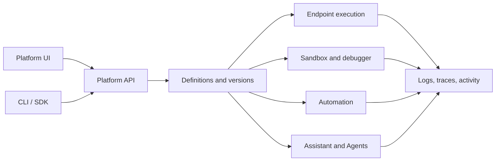

RevoEngine is an **enterprise Backend as a Service and governed-execution platform** for building, integrating, operating, and improving production software from one control plane. Teams combine versioned application logic, databases, Storage, HTTP endpoints, realtime delivery, durable automation, IAM/ACL, observability, and AI without assembling a disconnected runtime for each workflow.

Low-code is an authoring option. The durable product contract is broader: every workload is identity-bound, policy-controlled, observable, and connected to its versioned definition.

<CardGroup cols={2}>
  <Card title="Governed application execution" icon="server" href="/platform/enterprise-execution">
    Deliver endpoints, Jobs, data operations, files, events, and AI work through one identity- and policy-controlled execution plane.
  </Card>
  <Card title="Enterprise identity and access" icon="building-shield" href="/operate/identity-and-access">
    Integrate SSO/hybrid identity, service accounts, roles, Groups, ACLs, short-lived sessions, and machine credentials.
  </Card>
  <Card title="Operational evidence" icon="timeline" href="/operate/observability">
    Follow changes and execution through activity, versions, logs, traces, audit, durable history, and correlation IDs.
  </Card>
  <Card title="Governed AI" icon="robot" href="/ai/overview">
    Use the Assistant and durable Agents against the same authorized state, tools, evidence, approvals, and artifacts.
  </Card>
</CardGroup>

## One platform, two planes

RevoEngine separates configuration from execution:

- The **control plane** stores definitions, permissions, versions, and operational history through the Platform UI and Platform API.
- The **execution plane** serves endpoints, runs components, processes background work, streams realtime activity, and executes agent work.

This separation keeps authoring predictable while allowing each workload to scale and fail independently.

<Tip>
  Start with the [enterprise execution model](/platform/enterprise-execution) to understand the control loop, then choose an authoring path: low-code, custom Node.js, SDK, CLI, or Platform UI.
</Tip>

## Choose the document that matches the question

The documentation separates learning material from canonical contracts so an illustrative workflow never becomes an accidental API specification.

| Content type | Use it when | Start here |
| --- | --- | --- |
| Quickstart | You want the shortest path to a running Endpoint. | [Build your first Endpoint](/quickstart) |
| Guide | You are completing a real task across several platform areas. | [Secure order processing](/platform/first-production-workflow) |
| Concept | You need to understand ownership, lifecycle, or architecture before choosing a design. | [Platform overview](/platform/overview) |
| Product reference | You are configuring a specific UI or runtime surface. | [Endpoint configuration](/operate/endpoint-configuration) |
| Generated reference | You need an exact method, DTO, route, or response contract. | [Low-code API reference](/low-code/reference/index) |
| Operations | You are investigating, governing, or recovering production work. | [Observability](/operate/observability) |

<CardGroup cols={3}>
  <Card title="Quickstart" icon="bolt" href="/quickstart" />
  <Card title="Production guide" icon="shield-check" href="/platform/first-production-workflow" />
  <Card title="Developer options" icon="terminal" href="/developers/overview" />
  <Card title="API reference" icon="brackets-curly" href="/api-reference/introduction" />
</CardGroup>
