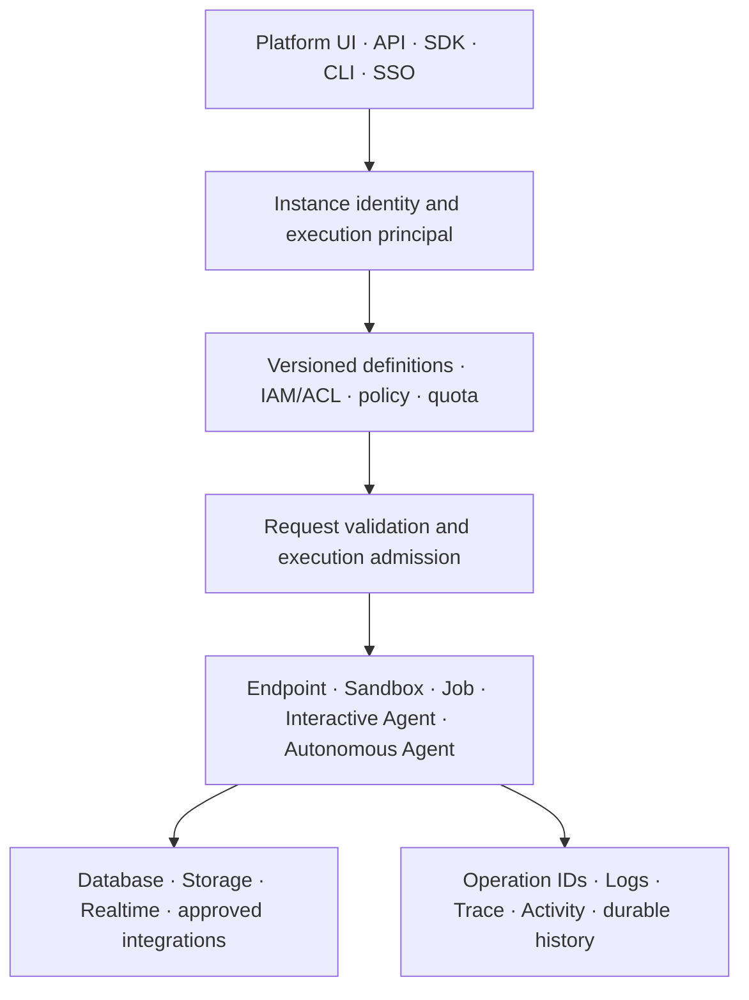

RevoEngine is an enterprise execution platform whose public contract is organized by responsibility. Teams can reason about governance, behavior, evidence, and recovery without depending on private deployment topology or infrastructure choices.

## Control plane

The Platform API is the source of truth for customer-visible definitions: Components, Endpoints, databases, Storage metadata, automation, identity, interactive threads, and Autonomous Agents. It publishes OpenAPI and enforces instance, role, permission-group, resource-ACL, and quota boundaries. The Platform UI, SDK, CLI, and AI surfaces use this same governed model rather than maintaining independent configuration planes.

## Execution plane

Execution behavior depends on the workload contract:

- endpoint requests are matched and executed synchronously;
- Sandbox requests run transient or stored components and can stream logs;
- background Jobs are admitted and persisted independently from the caller;
- realtime delivery distributes resource and activity changes;
- Interactive and Autonomous Agent turns use the shared Agent Harness over governed platform capabilities.

Every path resolves the current execution principal and current definition. A version or permission that existed when a caller began authoring is not treated as permanent authority at later execution time.

## Consistency model

Durable instance state is authoritative. Managed caches accelerate lookup but do not replace persisted definitions. Changes invalidate derived state automatically, while connected clients treat realtime delivery as a freshness signal rather than the source of truth.

## Failure boundaries

Each runtime reports a stable execution or operation identifier. Synchronous endpoints do not retry automatically because a failed connection does not prove that a remote mutation was not accepted. Background work uses durable job state and explicit retry controls. Agent mutations pass through approval and policy checks. Activity, version history, Trace, Logs, row audit, and execution histories provide complementary evidence rather than one overloaded “log” stream.
