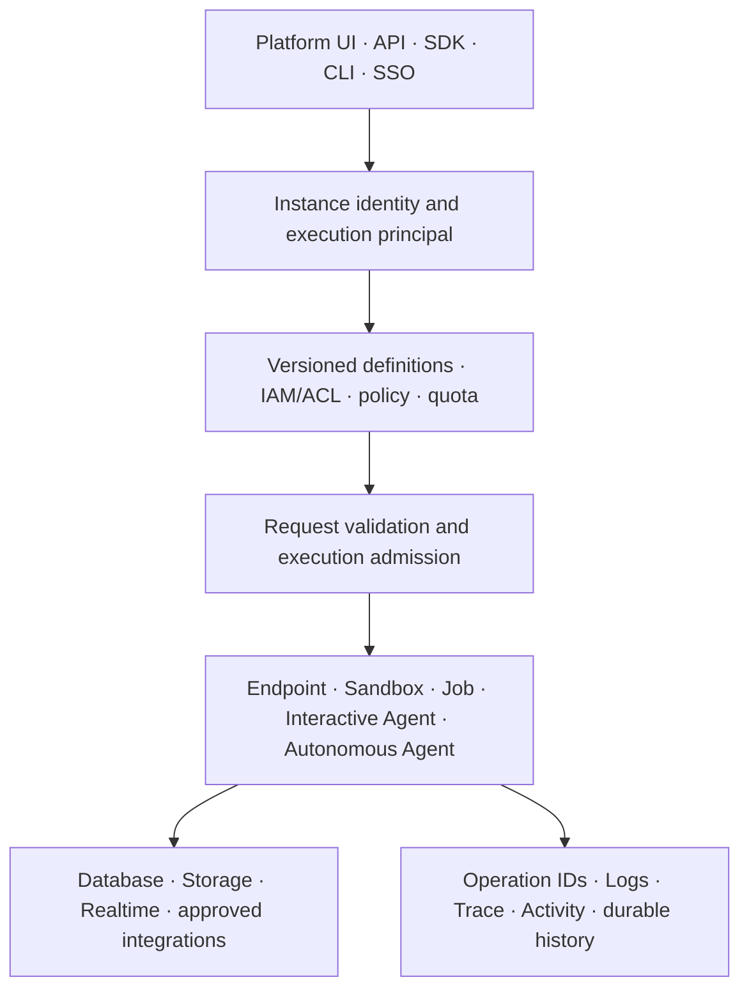

RevoEngine is an enterprise execution platform whose public contract is organized by responsibility. Teams can reason about governance, behavior, evidence, and recovery without depending on private deployment topology or infrastructure choices.

```mermaid
flowchart TB
    Access["Platform UI · API · SDK · CLI · SSO"] --> Identity["Instance identity and execution principal"]
    Identity --> Definition["Versioned definitions · IAM/ACL · policy · quota"]
    Definition --> Admission["Request validation and execution admission"]
    Admission --> Execute["Endpoint · Sandbox · Job · Interactive Agent · Autonomous Agent"]
    Execute --> Capabilities["Database · Storage · Realtime · approved integrations"]
    Execute --> Evidence["Operation IDs · Logs · Trace · Activity · durable history"]
```

## Control plane

The Platform API is the source of truth for customer-visible definitions: Components, Endpoints, databases, Storage metadata, automation, identity, interactive threads, and Autonomous Agents. It publishes OpenAPI and enforces instance, role, permission-group, resource-ACL, and quota boundaries. The Platform UI, SDK, CLI, and AI surfaces use this same governed model rather than maintaining independent configuration planes.

## Execution plane

Execution behavior depends on the workload contract:

- endpoint requests are matched and executed synchronously;
- Sandbox requests run transient or stored components and can stream logs;
- background Jobs are admitted and persisted independently from the caller;
- realtime delivery distributes resource and activity changes;
- Interactive and Autonomous Agent turns use the shared Agent Harness over governed platform capabilities.

Each execution uses the configured identity, permissions and selected definition. Deployment status and execution history identify the version that served a request.

## Consistency model

Persisted definitions and business records are the source of truth. Realtime updates notify connected clients of changes; clients can reload the persisted state when needed. Use operation identifiers and execution history to investigate failures and recovery.

## Failure boundaries

Each runtime reports a stable execution or operation identifier. Synchronous endpoints do not retry automatically because a failed connection does not prove that a remote mutation was not accepted. Background work uses durable job state and explicit retry controls. Agent mutations pass through approval and policy checks. Activity, version history, Trace, Logs, row audit, and execution histories provide complementary evidence rather than one overloaded “log” stream.
