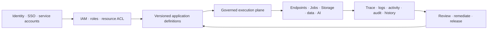

RevoEngine is an **enterprise governed-execution platform and Backend as a Service (BaaS)**. Low-code authoring is one way to build on it; it is not the product boundary. The platform's value is that every application capability—data, HTTP execution, files, automations, identity, AI, and operational evidence—uses the same tenant, identity, policy, version, and audit model.

That gives engineering, security, and operations teams one answer to: *what is running, under whose authority, against which version, with what data access, and what happened?*

## The enterprise control loop



The loop is intentionally closed. Authoring does not bypass runtime controls; runtime work does not disappear after a request completes; and operational evidence can lead back to the exact definition, principal, version, and approval decision.

## BaaS building blocks

| Domain | Enterprise value |
| --- | --- |
| Governed execution | Run synchronous Endpoint requests, transient Sandbox validations, durable Jobs, event targets, and Agents through distinct bounded execution paths. |
| Data services | Model Tables, Views, materialized reads, row audit, structured queries, lifecycle actions, and ACL-projected access without assembling a separate data-control layer. |
| Storage services | Manage files, folders, upload sessions, retention, artifact lifecycle, and hierarchical access controls as first-class application resources. |
| Integration and automation | Use components, endpoint contracts, schedules, events, webhooks, retries, concurrency, and idempotency to connect business systems safely. |
| Identity and policy | Apply tenant isolation, SSO/hybrid authentication, MFA-bound sessions, service accounts, API keys, role groups, Groups, and resource ACLs at the same decision boundary. |
| Operational evidence | Correlate Activity, version history, Trace, structured Logs, Job/Event/Webhook history, database row audit, usage, and AI artifacts. |
| Governed AI | Let Assistants and Agents inspect, reason over, validate, and—only when admitted—act on the same versioned, authorized platform state. |

## Enterprise identity: SSO, SAML, and machine access

RevoEngine supports organization identity-provider integration in **SSO** and **HYBRID** instance modes. Provider configuration can admit SAML-backed and OIDC/JWK-backed identities, with instance-level provider policy and user/role mapping. An SSO or hybrid instance cannot be left with an empty accepted-provider configuration.

Human access is not equivalent to a long-lived API token. The application establishes an instance-bound, short-lived session tied to the selected tenant, account, provider, trusted browser, and MFA/security revision. Service accounts and API keys remain the machine-to-machine path; their current roles and resource access are re-evaluated at the execution boundary.

<Note>
The exact identity-provider setup, claims mapping, and account-provisioning policy are organization-specific. Configure them through your approved identity-administration process; do not place provider secrets, assertions, or session material in Components, Jobs, or Assistant threads.
</Note>

## Defence in depth, not one permission switch

```text
authenticated identity
  -> selected and enabled instance
  -> platform role / permission group
  -> resource ACL where restricted
  -> current version and execution policy
  -> action / approval / plugin policy
  -> durable evidence
```

This means a valid API key does not become a superuser, a Component owner does not automatically grant a Job authority, and an AI tool does not bypass the caller's role or a protected Storage/Table ACL.

## Evidence that follows execution end to end

| Question | Evidence surface |
| --- | --- |
| Who changed a definition or selected a version? | Activity and version history. |
| Which request path was slow or failed? | Operation ID, Trace, Endpoint statistics, and Logs. |
| Did durable work finish after the HTTP caller disconnected? | Job, Event, Webhook, Agent run, and finalized Storage artifact state. |
| Which data rows changed and under which access model? | Database row audit and the owning Table ACL. |
| What did the Assistant or Agent inspect, propose, execute, or await approval for? | Thread/run timeline, tool artifacts, plan/action state, and report evidence. |

RevoEngine distinguishes *accepted*, *processing*, and *terminal* states. A 202/accepted control-plane response is not presented as business success; an operator can follow the durable identifier to a final status or artifact.

## The frontend and platform experience

The Platform UI is not a thin dashboard over disconnected services. It is the operator and builder surface for the same control plane used by the Platform API, SDK, CLI, and AI runtime. Teams use it to author versions, configure endpoint contracts, inspect data and Storage, manage IAM, observe live execution, review Activity, and act on AI plans/approvals.

Realtime delivery keeps authorized clients current, but durable state remains authoritative. The UI, API, and runtime all converge on the same versioned definitions and access decisions.

## What makes this different from a generic low-code tool

| A generic low-code focus | RevoEngine enterprise focus |
| --- | --- |
| Rapid screen or workflow assembly | Governed delivery of a full application backend and execution estate. |
| One builder persona | Builders, platform engineers, operators, security administrators, service identities, and supervised AI. |
| Best-effort workflow run | Versioned, identity-bound, policy-controlled execution with durable status and correlation. |
| Separate tools for API, Jobs, data, storage, and audit | One application model and control plane across those domains. |
| AI as a chat add-on | AI grounded in authorized platform state, evidence, tools, approvals, and persistent artifacts. |

## Recommended enterprise adoption path

1. Integrate approved human identity providers and define the SSO/hybrid access policy.
2. Establish permission groups, resource Groups, and service-account ownership before creating production automation.
3. Model data, Storage, Components, Endpoint contracts, and automation as versioned application definitions.
4. Adopt trace/operation IDs, Activity review, and database audit before regulated workflows go live.
5. Introduce Assistant plans and approvals for supervised change; use durable Agents only with explicit tools, identity, triggers, and operational ownership.

<CardGroup cols={2}>
  <Card title="Identity and access" href="/operate/identity-and-access" icon="users-gear">
    Configure users, service accounts, roles, Groups, ACLs, keys, and sessions.
  </Card>
  <Card title="Observability" href="/operate/observability" icon="chart-line">
    Trace changes and execution across every platform workload.
  </Card>
  <Card title="AI and Agents" href="/ai/overview" icon="sparkles">
    Use platform-aware AI under the same governance model.
  </Card>
  <Card title="Platform API" href="/developers/platform-api" icon="brackets-curly">
    Integrate programmatically with the control plane.
  </Card>
</CardGroup>
