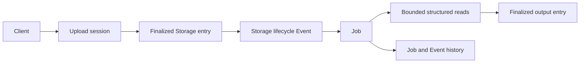

This guide connects a finalized Storage upload to durable background processing. Use it when a browser, partner, or external service uploads CSV, TSV, XLSX, or another file that must be validated and transformed after transfer.

## Architecture

## 1. Define the completion boundary

An upload session is a temporary control record. The durable input is the finalized `storageEntryId`. Do not start processing from a signed transfer response or an unfinished session.

Choose the statistics policy before creating the session:

- use synchronous statistics when finalization should return only after required metadata is ready;
- use asynchronous statistics when upload latency matters more, then start statistics-dependent work from the synchronized lifecycle event;
- use no statistics when the consumer does not need a derived index.

See [Storage upload sessions](/operate/storage-uploads) for direct, chunked, and incremental transfer rules.

## 2. Declare structured input when you know it

CSV, TSV, and XLSX use one shared structured-file schema contract. Declare columns and parsing policy when the producer and consumer already agree on the format.

Use the default fallback policy when an occasional malformed value should remain readable through a safe fallback. Use strict policy when a mismatched sheet, column, or value must reject finalization rather than enter the downstream workflow.

See [Structured files](/operate/storage-structured-files) for supported types, object parsing, null behavior, sheets, and schema policy.

## 3. Configure the Event

Subscribe to:

- `STORAGE_CREATED` when finalized bytes and entry metadata are sufficient;
- `STORAGE_SYNCHRONIZED` when asynchronous statistics or cached batch reads must already be available.

Filter on stable metadata such as destination folder, MIME type, declared purpose, or another controlled business marker. Treat the Event message as a trigger envelope; the Job should re-read authoritative Storage metadata before processing.

## 4. Run a durable Job

The selected Job template should:

1. read `storageEntryId` from the Event message;
2. load the current entry and validate its location, type, version, and metadata;
3. read structured data in bounded pages;
4. validate business invariants independently from parser type conversion;
5. write the result to a controlled folder;
6. return the input and output entry IDs plus the execution correlation identifier.

Make processing idempotent against the input entry identity and version. A retried Event or Job must not create duplicate business effects or unrelated output files.

## 5. Verify the outcome

Use different evidence for different questions:

| Question | Evidence |
| --- | --- |
| Did transfer become a durable file? | Finalized upload session and readable Storage entry |
| Did the Event admit the file? | Event History with matched target evidence |
| Did processing finish? | Terminal Job state, result, logs, and trace |
| Was output persisted? | Readable finalized output `storageEntryId` |
| Can the runtime identity use both files? | Storage access checked as the Job service account |

An Event dispatch or successful Job submission is not proof that processing or output persistence completed.

## Failure policy

- If finalization is uncertain, read the upload session before creating another one.
- If parsing fails under strict policy, keep the rejected input for operator inspection according to retention policy.
- If external effects occur after reading the file, use a business idempotency key and reconcile ambiguous timeouts.
- If output persistence fails after another business effect succeeded, reconstruct the output from the durable business record rather than repeating the external effect.

<CardGroup cols={2}>
  <Card title="Storage lifecycle" href="/operate/storage" icon="hard-drive" />
  <Card title="Events" href="/operate/events" icon="bolt" />
  <Card title="Jobs" href="/operate/jobs" icon="gears" />
  <Card title="Structured files" href="/operate/storage-structured-files" icon="table" />
</CardGroup>
