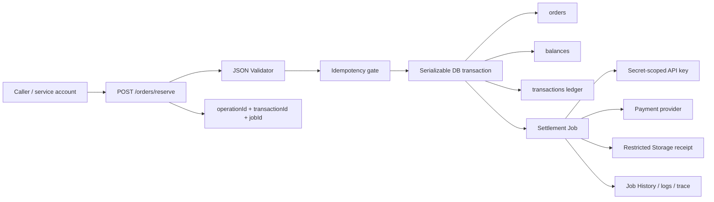

<Info>
  This is a task-oriented guide, not the canonical API reference. Use it to see several RevoEngine capabilities working together, then follow the links to the field-by-field and generated references.
</Info>

This guide implements a payment-style reservation flow. A caller submits an existing order. RevoEngine authenticates the workload, validates the request, prevents duplicate processing, locks the relevant rows, reserves the balance, writes a transaction record, and returns an `operationId` that an operator can follow through the platform.

The example deliberately stores money in **minor units** (`1250` means `12.50`) and reads the amount, account, and currency from the governed `orders` Table. A caller cannot replace those trusted values in the request body.

<CardGroup cols={3}>
  <Card title="Protect the command" icon="key">
    A service account, least-privilege access, a JSON request guard, and an idempotency key bound the public operation.
  </Card>
  <Card title="Commit one state change" icon="database">
    A serializable transaction locks the order and balance, then writes the balance, order state, and ledger entry together.
  </Card>
  <Card title="Prove what happened" icon="timeline">
    The response, structured logs, Job History, Table audit, and Trace share stable business and platform identifiers.
  </Card>
</CardGroup>

## Architecture



The synchronous boundary reserves funds and produces a durable ledger fact. The Job performs slower or retryable provider work **after** the database transaction commits. Never keep a database lock open while waiting for an external API.

## What this one workflow demonstrates

| Application concern | RevoEngine surface in this guide |
| --- | --- |
| Client contract | Endpoint, request guard, generated OpenAPI, status and response shaping |
| Business logic | Versioned TypeScript Components and reusable runtime declarations |
| Data and consistency | Restricted Tables, constraints, row locks, serializable transaction, audit |
| Identity and security | Service account, Permissions, Groups, ACLs, Secrets, redaction |
| External integration | Authenticated JSON egress through `api.httpCall()` |
| Background processing | Durable Job, concurrency, retry, timeout, reconciliation |
| Files and evidence | Restricted Storage folders and generated settlement receipts |
| Production operations | Operation, execution, transaction, order, and Job correlation |

The same platform model also covers realtime delivery, scheduled and event-driven work, SDK/CLI workflows, custom Node.js, frontend integrations, and governed AI. Those areas have their own guides and references instead of being forced into this sample.

## Before you begin

You need permission to create or update Components, Endpoints, Job templates, JSON Validator Components, and Tables. For production, create a dedicated service account such as `payments-runtime` and grant it only the roles and restricted-resource membership required by this workflow.

| Resource | Runtime access | Operator access |
| --- | --- | --- |
| `orders` | Read and update | Payments support and finance groups |
| `balances` | Read and update | Finance operations only |
| `transactions` | Read, insert, and update settlement fields | Finance and audit groups |
| Settlement credentials | Read one named Secret | Secret administrators only |
| Job template | Trigger | Payments runtime and selected operators |

<Warning>
  Do not put provider credentials, complete request bodies, card data, or unrestricted customer records in Component source, Endpoint metadata, logs, or Job input. Store secrets in **Secrets** and retain only the identifiers needed to investigate an operation.
</Warning>

## 1. Model the durable state

Open **Databases** and create three restricted Tables. Enable **Audit** before live writes begin; enabling it later does not reconstruct earlier row history.

### `orders`

| Field | Type | Settings | Purpose |
| --- | --- | --- | --- |
| `orderId` | `UUID` | Primary, unique, not nullable | Stable order identity. |
| `accountId` | `UUID` | Indexed, not nullable | Selects the governed balance. |
| `amountMinor` | `BIGINT` | Not nullable | Amount in minor currency units. |
| `currency` | `TEXT` | Indexed, not nullable | Prevents cross-currency reservations. |
| `status` | `TEXT` | Indexed, not nullable | For example `PENDING`, `RESERVED`, `SETTLED`, or `FAILED`. |
| `reservationTransactionId` | `UUID` | Nullable | Links the order to its ledger entry. |
| `lastOperationId` | `TEXT` | Nullable | Links the business state to RevoEngine Trace. |

### `balances`

| Field | Type | Settings | Purpose |
| --- | --- | --- | --- |
| `balanceId` | `UUID` | Primary, unique, not nullable | Stable balance identity. |
| `accountId` | `UUID` | Indexed, not nullable | Business account owner. |
| `currency` | `TEXT` | Indexed, not nullable | Balance currency. |
| `availableMinor` | `BIGINT` | Not nullable | Funds still available to reserve. |
| `reservedMinor` | `BIGINT` | Not nullable | Funds reserved by open orders. |
| `lastOperationId` | `TEXT` | Nullable | Latest operation touching the balance. |

Create a unique business constraint for the account and currency combination if each account owns only one balance per currency.

### `transactions`

| Field | Type | Settings | Purpose |
| --- | --- | --- | --- |
| `transactionId` | `UUID` | Primary, unique, not nullable | Ledger entry identity. |
| `requestKey` | `TEXT` | Unique, not nullable | Durable idempotency boundary. |
| `orderId` | `UUID` | Indexed, not nullable | Related order. |
| `accountId` | `UUID` | Indexed, not nullable | Related account. |
| `type` | `TEXT` | Indexed, not nullable | `RESERVATION` in this guide. |
| `amountMinor` | `BIGINT` | Not nullable | Immutable ledger amount. |
| `currency` | `TEXT` | Not nullable | Immutable ledger currency. |
| `status` | `TEXT` | Indexed, not nullable | Starts as `PENDING_SETTLEMENT`. |
| `operationId` | `TEXT` | Indexed, not nullable | Platform correlation identifier. |
| `settlementOperationId` | `TEXT` | Nullable | Correlates the later Job execution. |
| `requestedBy` | `UUID` | Nullable | User or service-account identity. |
| `providerReference` | `TEXT` | Nullable | Safe external correlation identifier. |
| `receiptStorageEntryId` | `UUID` | Nullable | Restricted Storage evidence. |
| `settledAt` | `TIMESTAMPTZ` | Nullable | Confirmed provider completion time. |

Treat the `transactions` Table as an append-oriented ledger. Settlement should append or transition an explicit transaction state according to your accounting model; it should not silently rewrite the original amount.

## 2. Validate the public command

Create a `JSON_VALIDATOR` Component and add an element such as `reserveOrderRequest`. The command accepts only the order ID and a caller-generated idempotency key:

```json
{
  "type": "object",
  "additionalProperties": false,
  "required": ["orderId", "requestKey"],
  "properties": {
    "orderId": {
      "type": "string",
      "format": "uuid"
    },
    "requestKey": {
      "type": "string",
      "minLength": 16,
      "maxLength": 128,
      "pattern": "^[A-Za-z0-9._:-]+$"
    }
  }
}
```

The amount, currency, destination account, and desired order status are intentionally absent. They come from trusted rows selected under the runtime principal.

## 3. Implement the reservation Component

Create a `CODE_TS` Component named `Reserve order balance`. The code below uses the same public declarations delivered to Monaco.

```ts
type Order = {
  orderId: string;
  accountId: string;
  amountMinor: string;
  currency: string;
  status: string;
};

type Balance = {
  balanceId: string;
  accountId: string;
  currency: string;
  availableMinor: string;
  reservedMinor: string;
};

const { orderId, requestKey } = api.input()?.body as {
  orderId: string;
  requestKey: string;
};

const operationId = api.getOperationId();
const principal = api.currentUser();
const gateKey = `order-reservation:${requestKey}`;
const settleOrderTemplateId = String(
  api.input()?.templateInputs?.settleOrderTemplateId,
);

if (!util.isUUID(settleOrderTemplateId)) {
  api.throw(500, { message: 'Settlement Job template is not configured', operationId });
}

const acquired = await api.acquireIdempotencyKey(gateKey, 86_400, {
  operationId,
  orderId,
  state: 'PROCESSING',
});

if (!acquired) {
  const existing = await api.getDatabaseData('transactions', {
    filter: { field: 'requestKey', op: 'eq', value: requestKey },
    take: 1,
  });

  if (existing.results === 1) {
    return {
      operationId,
      originalOperationId: existing.data[0].operationId,
      duplicate: true,
      transactionId: existing.data[0].transactionId,
      status: existing.data[0].status,
    };
  }

  api.throw(409, {
    message: 'A request with this idempotency key is already processing',
    operationId,
  });
}

let reservation;

try {
  reservation = await api.transactionDatabase(async (tx) => {
    const existingTransactions = await tx.getDatabaseData(
      'transactions',
      {
        filter: { field: 'requestKey', op: 'eq', value: requestKey },
        take: 1,
      },
      { lock: 'update' },
    );

    if (existingTransactions.results === 1) {
      return {
        duplicate: true,
        transactionId: existingTransactions.data[0].transactionId,
        originalOperationId: existingTransactions.data[0].operationId,
      };
    }

    const orders = await tx.getDatabaseData<Order>(
      'orders',
      {
        filter: { field: 'orderId', op: 'eq', value: orderId },
        take: 1,
      },
      { lock: 'update' },
    );

    if (orders.results !== 1) {
      api.throw(404, { message: 'Order not found', operationId });
    }

    const order = orders.data[0];

    if (order.status !== 'PENDING') {
      api.throw(409, {
        message: 'Order is not eligible for reservation',
        operationId,
        currentStatus: order.status,
      });
    }

    const balances = await tx.getDatabaseData<Balance>(
      'balances',
      {
        filter: {
          and: [
            { field: 'accountId', op: 'eq', value: order.accountId },
            { field: 'currency', op: 'eq', value: order.currency },
          ],
        },
        take: 1,
      },
      { lock: 'update' },
    );

    if (balances.results !== 1) {
      api.throw(409, { message: 'Balance is unavailable', operationId });
    }

    const balance = balances.data[0];
    const amountMinor = BigInt(order.amountMinor);
    const availableMinor = BigInt(balance.availableMinor);
    const reservedMinor = BigInt(balance.reservedMinor);

    if (amountMinor <= 0n || availableMinor < amountMinor) {
      api.throw(409, { message: 'Insufficient available balance', operationId });
    }

    const transactionId = util.randomUUID();

    await tx.updateDatabaseData(
      'balances',
      { balanceId: balance.balanceId },
      {
        availableMinor: (availableMinor - amountMinor).toString(),
        reservedMinor: (reservedMinor + amountMinor).toString(),
        lastOperationId: operationId,
      },
    );

    await tx.updateDatabaseData(
      'orders',
      { orderId: order.orderId, status: 'PENDING' },
      {
        status: 'RESERVED',
        reservationTransactionId: transactionId,
        lastOperationId: operationId,
      },
    );

    await tx.insertDatabaseData('transactions', [{
      transactionId,
      requestKey,
      orderId: order.orderId,
      accountId: order.accountId,
      type: 'RESERVATION',
      amountMinor: amountMinor.toString(),
      currency: order.currency,
      status: 'PENDING_SETTLEMENT',
      operationId,
      requestedBy: principal.userId,
    }]);

    return {
      duplicate: false,
      transactionId,
      originalOperationId: undefined,
      accountId: order.accountId,
      amountMinor: amountMinor.toString(),
      currency: order.currency,
    };
  }, {
    isolationLevel: 'SERIALIZABLE',
    timeoutMs: 15_000,
  });
} catch (error) {
  await api.releaseIdempotencyKey(gateKey);
  throw error;
}

const jobId = reservation.duplicate
  ? undefined
  : await api.triggerJob(settleOrderTemplateId, {
      orderId,
      transactionId: reservation.transactionId,
      parentOperationId: operationId,
    });

api.log({
  message: 'Order balance reserved',
  args: {
    operationId,
    orderId,
    transactionId: reservation.transactionId,
    jobId,
    requestedBy: principal.userId,
  },
}, 'INFO');

return {
  operationId,
  transactionId: reservation.transactionId,
  jobId,
  duplicate: reservation.duplicate,
  originalOperationId: reservation.originalOperationId,
  status: reservation.duplicate ? 'ALREADY_RESERVED' : 'RESERVED',
};
```

<Warning>
  `api.transactionDatabase()` commits when its callback resolves and rolls back when it throws. Await each `tx.*` call sequentially; parallel transaction operations are rejected. The default timeout is 15 seconds, and explicit `timeoutMs` values are limited to 1–30 seconds.
</Warning>

The instance-cache idempotency gate suppresses concurrent duplicates. The unique `transactions.requestKey` and existing ledger row are the durable business truth after the cache entry expires.

## 4. Configure the Endpoint

Open **Endpoints**, create the definition inactive, and configure it before activation.

| UI field | Value for this guide | Reason |
| --- | --- | --- |
| Name | `Reserve order balance` | Searchable operator name. |
| Method | `POST` | The command changes state. |
| Path | `/orders/reserve` | Stable public route. |
| Component | `Reserve order balance` | Selects the reviewed logic. |
| Component Version | Exact reviewed version | Prevents an unrelated activation changing the contract. |
| Runtime input | `settleOrderTemplateId` | Keeps deployment configuration outside caller-controlled input. |
| Request guard | `reserveOrderRequest` | Rejects malformed input before execution. |
| Validation status | `422` | Separates invalid input from business conflicts. |
| Success status | `200` | The balance reservation is complete when returned. |
| Hide validation details | On for public clients | Avoids exposing internal schema details. |
| Hide request | On | Reduces retained sensitive payload data. |
| Hide response | Off or policy-driven | Keeps the returned IDs available to authorized support. |

Use the smallest practical timeout and memory budget. Inspect the generated OpenAPI operation and exercise both accepted and rejected requests while the definition remains inactive.

### Request

```bash
curl --request POST \
  --url "$REVO_ENDPOINT_URL/orders/reserve" \
  --header "Authorization: Bearer $REVO_SERVICE_ACCOUNT_KEY" \
  --header "Content-Type: application/json" \
  --data '{
    "orderId": "0195af19-9b41-7a7c-8c5c-35ab875e165c",
    "requestKey": "checkout-0195af19-9b41-7a7c-8c5c-35ab875e165c-v1"
  }'
```

### Response

```json
{
  "operationId": "0195af23-78d0-7c6c-b444-82238598e122",
  "transactionId": "0195af23-7a2e-7567-a9a2-8ab735cf3788",
  "jobId": "0195af23-7b7a-7d17-ae86-c4b16d8e47ec",
  "status": "RESERVED"
}
```

Also retain the `x-revo-oid` response header in the calling system. It is the fastest starting point for a cross-service trace when a client did not preserve the JSON response.

## 5. Configure durable settlement

Create a Job template for the provider call. The Job reads the transaction by `transactionId`, verifies that its state is still eligible, calls the provider with a provider-side idempotency key, and records only the safe provider reference.

| Job setting | Initial policy | Why |
| --- | --- | --- |
| Trigger user | `payments-runtime` service account | Prevents execution under a developer identity. |
| Runtime input | Provider name and non-secret policy only | Per-order data arrives in the invocation input. |
| Concurrency key | `settle-order` | Bounds simultaneous provider work. |
| Concurrency limit | Provider- and tenant-appropriate | Protects provider and platform capacity. |
| Retry | Transient failures only | Authentication or validation failures require intervention. |
| Max attempts | Small and explicit | Includes the original attempt. |
| Timeout | Below the provider and platform deadline | Leaves time to record a controlled failure. |

Jobs can run much longer than Endpoints, but they are still bounded. Instance policy can grant up to **59 minutes** of execution time and **4 GiB** of memory. Design larger work as checkpoints or multiple Jobs rather than assuming an unbounded process, and reserve only the memory the workload actually needs.

<Tip>
  A remote timeout is ambiguous: the provider might have completed the operation before the connection failed. Query by the provider idempotency/correlation key before retrying the side effect.
</Tip>

### Settlement worker: Secret, HTTP egress, and Storage evidence

Before activating the template, create `PAYMENTS_API_URL` and `PAYMENTS_API_KEY` under **Secrets**, grant the Job service account access to those names, and pre-create `payments/settlement-receipts` as a restricted Storage path for finance/audit groups. The Component still verifies effective restriction at runtime because `storage.ensureFolderPath()` does not mutate ACLs on folders that already exist.

The settlement Component resolves credentials at runtime, sends a JSON request to the provider, updates the ledger, and writes a restricted receipt artifact. It never returns or logs the resolved API key. The originating Endpoint operation and the Job operation remain separate but linked.

```ts
type SettlementInput = {
  transactionId: string;
  parentOperationId: string;
};

const { transactionId, parentOperationId } = api.input()?.message as SettlementInput;
const operationId = api.getOperationId();
const secrets = await api.getSecrets([
  'PAYMENTS_API_URL',
  'PAYMENTS_API_KEY',
]);

const transactions = await api.getDatabaseData('transactions', {
  filter: { field: 'transactionId', op: 'eq', value: transactionId },
  take: 1,
});

if (transactions.results !== 1) {
  api.throw(404, { message: 'Transaction not found', operationId });
}

const transaction = transactions.data[0];

const provider = await api.httpCall(
  {
    url: `${secrets.PAYMENTS_API_URL}/v1/settlements`,
    method: 'POST',
    headers: {
      Authorization: `Bearer ${secrets.PAYMENTS_API_KEY}`,
      'Idempotency-Key': transaction.transactionId,
      'X-Correlation-ID': operationId,
    },
    data: {
      transactionId: transaction.transactionId,
      amountMinor: transaction.amountMinor,
      currency: transaction.currency,
    },
  },
  {
    requestType: 'json',
    responseType: 'json',
    timeout: 15_000,
  },
);

if (provider.status < 200 || provider.status >= 300) {
  api.log({
    message: 'Payment provider rejected settlement',
    args: {
      operationId,
      transactionId,
      providerStatus: provider.status,
      durationMs: provider.time,
    },
  }, 'WARN');

  api.throw(424, {
    message: 'Settlement provider did not accept the operation',
    operationId,
    transactionId,
  });
}

if (typeof provider.data?.reference !== 'string') {
  api.throw(424, {
    message: 'Settlement provider returned an invalid response',
    operationId,
    transactionId,
  });
}

const providerReference = provider.data.reference;
const settledAt = new Date().toISOString();

await api.updateDatabaseData(
  'transactions',
  { transactionId, status: 'PENDING_SETTLEMENT' },
  { status: 'SETTLED', providerReference, settledAt, settlementOperationId: operationId },
);

const receiptFolder = await storage.ensureFolderPath(
  'payments/settlement-receipts',
  { restricted: true },
);

if (!receiptFolder.effectiveRestricted) {
  api.throw(500, {
    message: 'Settlement receipt folder is not restricted',
    operationId,
    parentOperationId,
    transactionId,
  });
}

const receiptName = `settlement-${transactionId}.json`;
const priorReceipts = await storage.explore({
  parentStorageEntryId: receiptFolder.storageEntryId,
  term: receiptName,
  take: 10,
});
const priorReceipt = priorReceipts.data.find(
  (entry) => entry.name === receiptName,
);

const receipt = priorReceipt ?? await storage.putObject({
  parentStorageEntryId: receiptFolder.storageEntryId,
  name: receiptName,
  data: JSON.stringify({
    operationId,
    parentOperationId,
    transactionId,
    orderId: transaction.orderId,
    amountMinor: transaction.amountMinor,
    currency: transaction.currency,
    providerReference,
    settledAt,
  }, null, 2),
  mimeType: 'application/json',
  computeStats: 'sync',
  metadata: {
    operationId,
    parentOperationId,
    transactionId,
    documentType: 'settlement-receipt',
  },
});

await api.updateDatabaseData(
  'transactions',
  { transactionId },
  { receiptStorageEntryId: receipt.storageEntryId },
);

api.log({
  message: 'Order settlement completed',
  args: {
    operationId,
    parentOperationId,
    transactionId,
    providerReference,
    receiptStorageEntryId: receipt.storageEntryId,
    providerDurationMs: provider.time,
  },
}, 'INFO');

return {
  operationId,
  parentOperationId,
  transactionId,
  providerReference,
  receiptStorageEntryId: receipt.storageEntryId,
  status: 'SETTLED',
};
```

<Warning>
  Never log `provider.request`, request headers, the Secret value, or an unrestricted provider response. `api.httpCall()` returns diagnostic request data for runtime use; application logs should contain only allowlisted identifiers, status, and timing.
</Warning>

If the HTTP connection times out, query the provider with the same `transactionId` idempotency key before sending another settlement. If Storage writing fails after provider success, a retry can reconstruct the deterministic receipt from the settled ledger record without repeating the provider effect.

## 6. Test the failure paths

<Steps>
  <Step title="Validate the happy path">
    Seed one `PENDING` order and a matching balance. Confirm that available funds decrease, reserved funds increase, one ledger row appears, and the response exposes all three identifiers.
  </Step>
  <Step title="Replay the same request">
    Send the same `requestKey`. Confirm that no second reservation or ledger entry is created and the prior transaction can be identified.
  </Step>
  <Step title="Race two requests">
    Submit two different requests against the same balance. Confirm that row locking and serializable isolation prevent overspending.
  </Step>
  <Step title="Reject insufficient funds">
    Confirm a `409` response, no partial balance update, no reserved order state, and no ledger insert.
  </Step>
  <Step title="Interrupt settlement">
    Simulate a provider timeout. Confirm that the Job retry preserves `transactionId`, `operationId`, retry lineage, and provider idempotency metadata.
  </Step>
  <Step title="Verify least privilege">
    Run with the real service account, then remove one required Table or Secret permission and confirm the workflow fails closed.
  </Step>
</Steps>

## 7. Investigate one operation

Start with the identifier closest to the report:

| Identifier | Open first | Question answered |
| --- | --- | --- |
| `operationId` or `x-revo-oid` | Trace | Which distributed path did the request take? |
| `transactionId` | `transactions` Table | Which durable business state was recorded? |
| `jobId` | Jobs History | Did settlement run, retry, fail, or finish? |
| `orderId` | `orders` and Audit | What state does the customer-facing order have? |
| `accountId` | `balances` and Audit | Which balance change was committed and by whom? |

In **Jobs History**, inspect status, duration, attempt, selected template and Component version, timestamps, metadata, and actor. In **Databases → Audit**, verify the balance and order transition. In **Trace**, follow the `operationId` across Endpoint execution and Job dispatch.

<Note>
  A successful Endpoint response proves that reservation committed and settlement was scheduled. It does not prove that the provider settled the order. Customer notification should follow a terminal Job state plus a confirmed transaction/provider state.
</Note>

## Production extensions

This guide keeps the architecture visible rather than pretending to be a complete payment system. A production implementation commonly adds:

- a reconciliation Job for transactions stuck in `PENDING_SETTLEMENT`;
- an append-only settlement/reversal ledger policy;
- provider webhook verification and replay protection;
- currency- and tenant-specific limits;
- dual-control approval for high-value or manual operations;
- dashboards and alerts for age, retries, failure classes, and balance invariants;
- retention and redaction rules aligned with financial and privacy obligations.

## Reference, architecture, and operations

<CardGroup cols={2}>
  <Card title="Database runtime reference" icon="brackets-curly" href="/low-code/reference/api">
    Search exact signatures for transactions, row reads and writes, idempotency, Jobs, logs, and operation IDs.
  </Card>
  <Card title="Database definitions" icon="table-columns" href="/operate/database-definitions">
    Configure field types, constraints, indexes, references, audit, and access boundaries.
  </Card>
  <Card title="Endpoint configuration" icon="sliders" href="/operate/endpoint-configuration">
    Review every route, validation, runtime, response, and retention option.
  </Card>
  <Card title="Identity and access" icon="users-gear" href="/operate/identity-and-access">
    Configure users, service accounts, Groups, Permissions, API keys, and resource ACLs.
  </Card>
  <Card title="Jobs" icon="briefcase" href="/operate/jobs">
    Understand execution limits, retries, concurrency, long-running work, and history.
  </Card>
  <Card title="Traces and correlation" icon="timeline" href="/operate/traces">
    Investigate a distributed operation without collecting secrets.
  </Card>
  <Card title="HTTP and Storage" icon="cloud-arrow-up" href="/low-code/http-and-storage">
    Integrate JSON APIs, stream large payloads, and create governed Storage artifacts.
  </Card>
</CardGroup>
